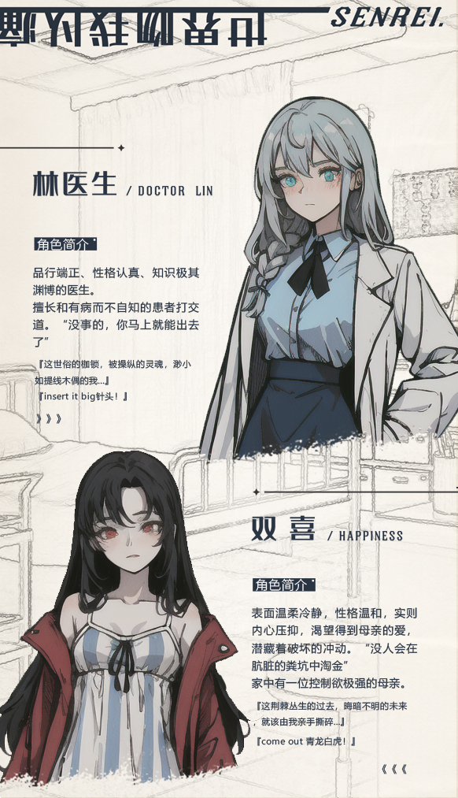
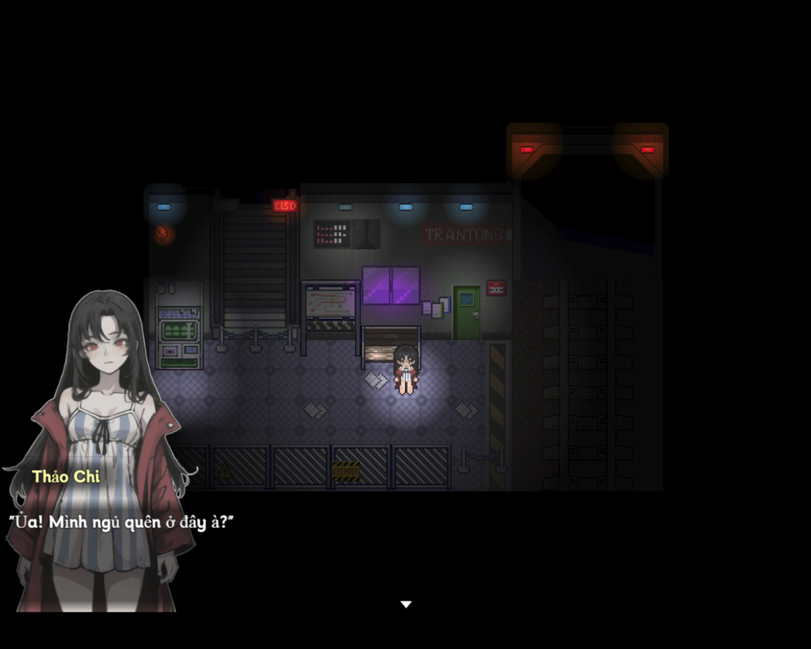
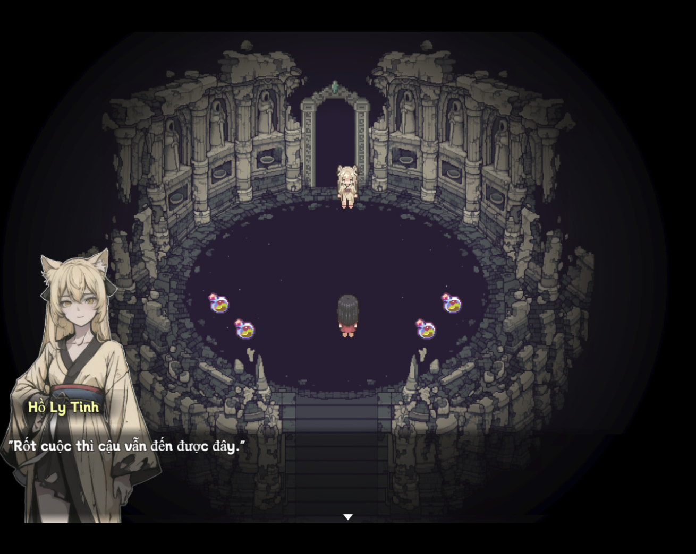
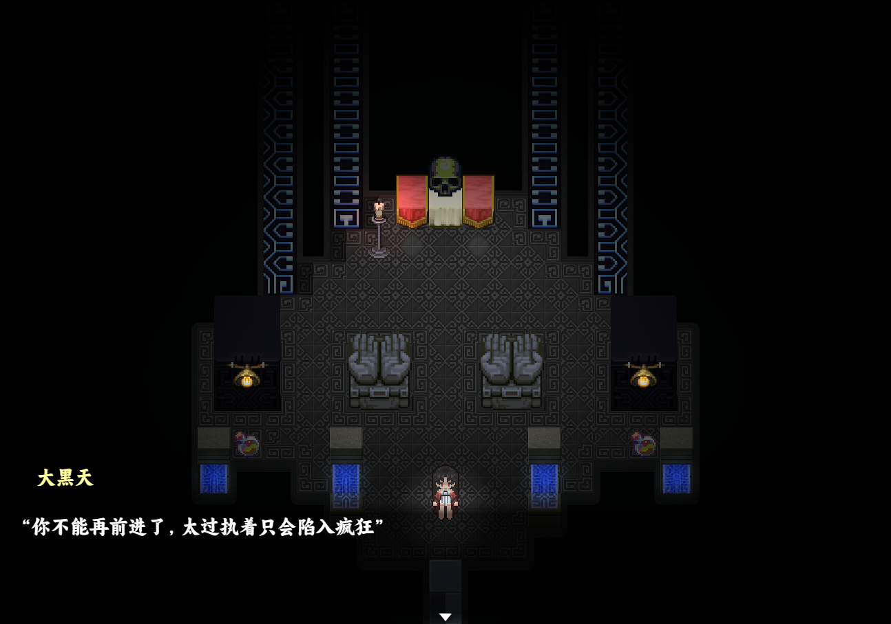
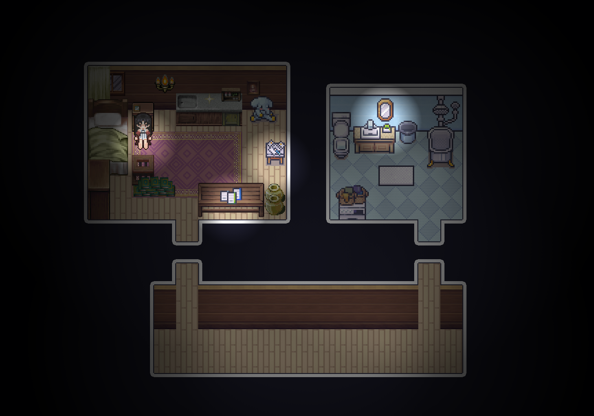
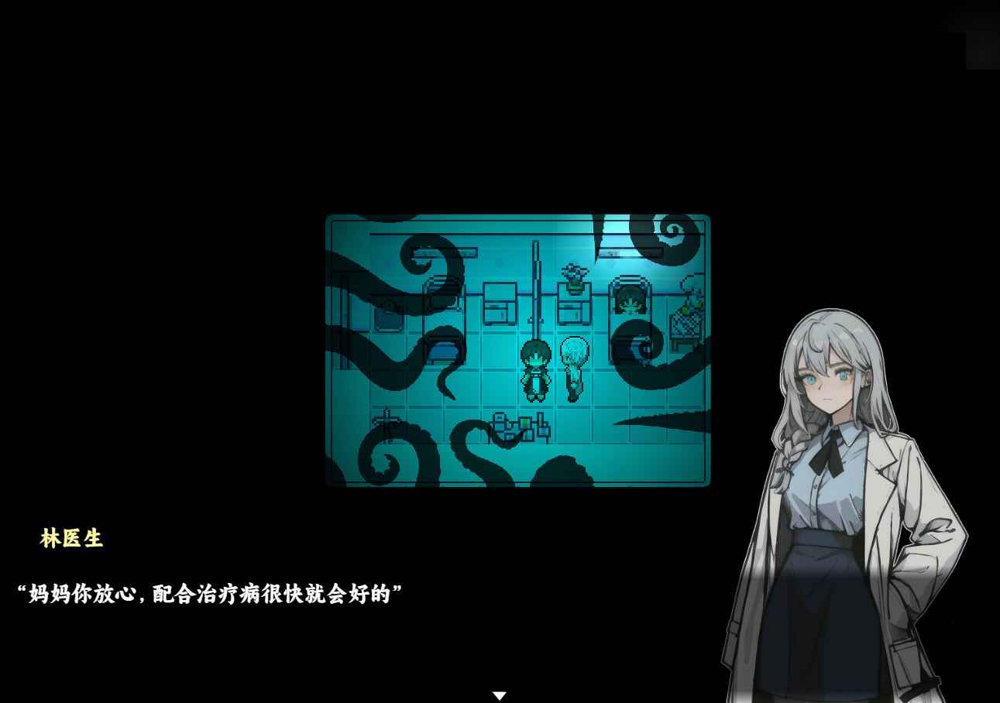
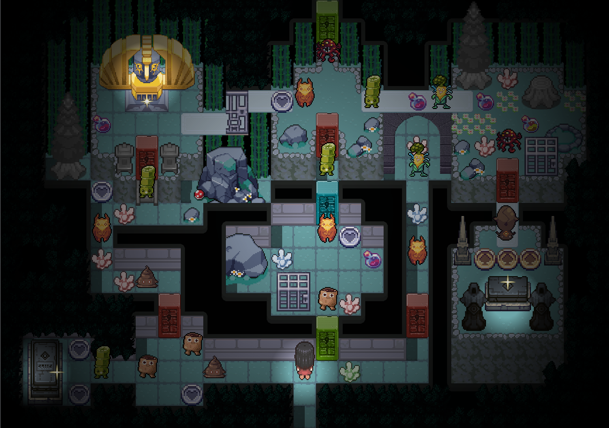
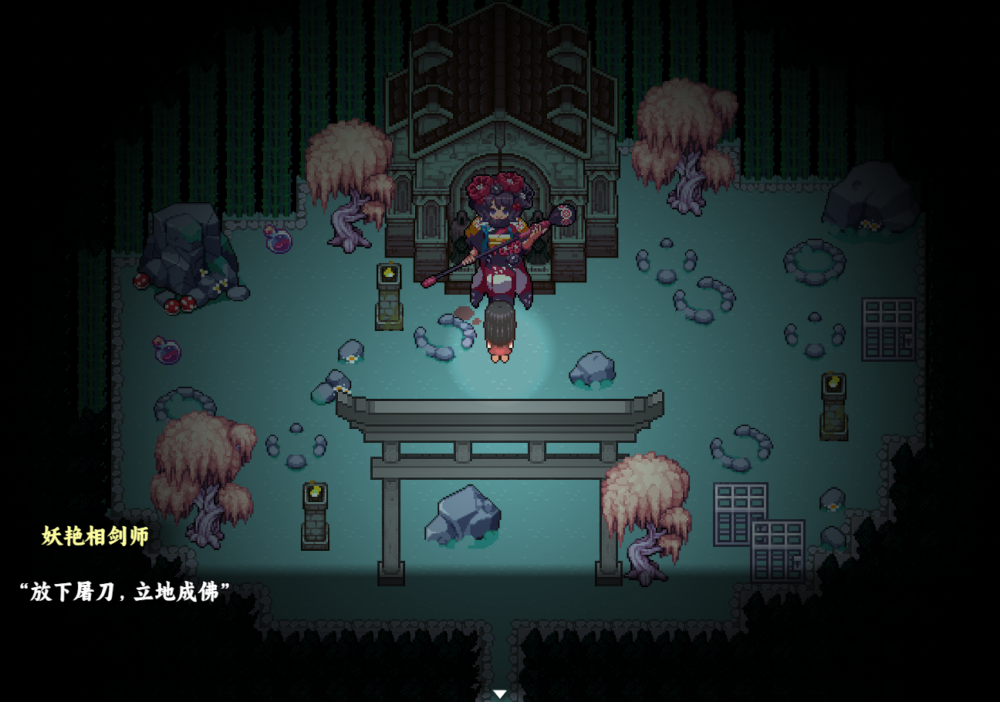

>## [Tải Xuống ⬇️ (Nhạc bị dính bản quyền)](https://drive.google.com/file/d/1yd9M9IIia6r7luwL0Ay1GEx08wM8LK9u/view?usp=drive_link) 
>## [Tải Xuống ⬇️ (Phiên bản thay nhạc không bản quyền)](https://drive.google.com/file/d/1aw3SpN6_a1naB6BUSc9NNlg_dwQViUWV/view) 

---
## 📖【Giới thiệu game】

- Tôi không bị bệnh, nhưng lại bị đưa vào bệnh viện tâm thần.”   

   Tuy vậy, ngày nào tôi cũng rất phối hợp uống thuốc đúng giờ.   

   Bởi vì sau khi uống thuốc xong, tinh thần tôi sẽ đi đến một thế giới khác.   

   Những báu vật rơi ra từ boss còn có thể mang ngược về bệnh viện.   

   Một cô gái phát hiện bản thân thường xuyên xuyên không đến một thế giới kỳ ảo khác để đánh quái. Người xung quanh cho rằng cô bị tâm thần nên đã đưa cô vào bệnh viện tâm thần.   

   Dần dần, cô nhận ra bác sĩ điều trị cho mình và cả người mẹ thường đến thăm mình đều có điều gì đó kỳ lạ. Đồng thời trạng thái tinh thần của cô cũng ngày càng trở nên bất ổn.   

   Rốt cuộc thế giới kỳ ảo kia hay bệnh viện tâm thần mới là hiện thực?   
   Liệu cô thật sự sở hữu năng lực đặc biệt, hay đúng là mắc bệnh tâm thần?   

   Và chân tướng của tất cả chuyện này hóa ra lại là…   
:::note
- Game có nội dung tầm 1h chơi với 1 ending.
:::
## 🖥️【Ảnh chụp màn hình】

## 🎮【Cách điều khiển】

| Tương tác               | Phím bấm
|-------------------------|----------------------------------------------------------------------------------------------------------------------------------------|
| `Di chuyển`             | Phím mũi tên                                                                                                                           |
| `Điều tra / Xác nhận`   | Z / Space                                                                                                                              |
| `Menu / Hủy`            | X / ESC                                                                                                                                |
| `Sử dụng vật phẩm`      | Mở menu → chọn vật phẩm → nhấn phím xác nhận                                                                                           |
| `Tăng tốc`              | Shift                                                                                                                                  |

## ⚠️【Lưu ý】
:::tip
Nếu lỗi font hay cài font game vào máy tính!
:::
🫰 Cuối cùng chúc mọi người chơi game vui vẻ 0w0