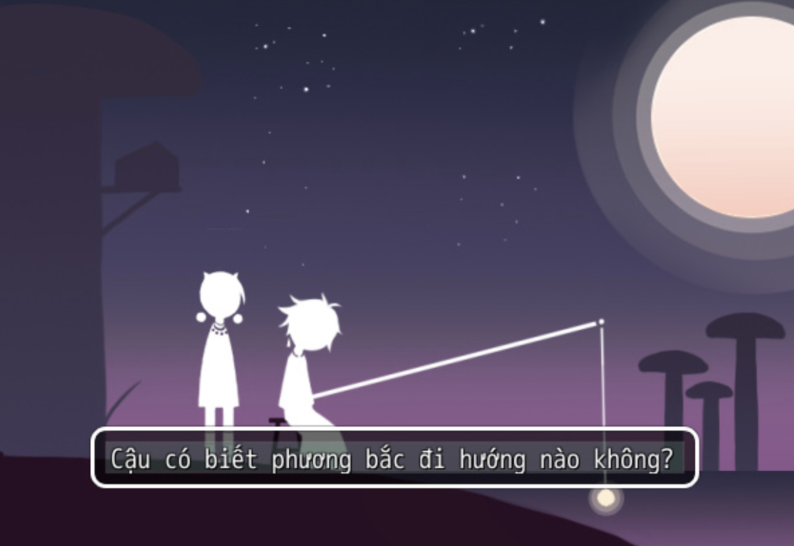

>## [Tải Xuống](https://drive.google.com/file/d/1uGdgc50HNRGnpqvXE75X7pc4fNiEwZR8/view) ⬇️
---
## 【Giới thiệu game】

- Trên một hành tinh hoang vắng nhưng ấm áp, một cô gái sinh ra từ kén du hành về phía bắc, tìm kiếm dấu vết của nền văn minh.
- Game có nội dung tầm 10p chơi với 3 Ending

## 【Ảnh chụp màn hình】

## 【Cách điều khiển】

- Di chuyển: Phím mũi tên  
- Điều tra / Xác nhận: Z / Space  
- Menu / Hủy: X / ESC  
- Sử dụng vật phẩm: Mở menu → chọn vật phẩm → nhấn phím xác nhận  
- Tăng tốc: Shift  

## 【Lưu ý】

Không có lưu ý nào cả!

Cuối cùng chúc mọi người chơi game vui vẻ 0w0