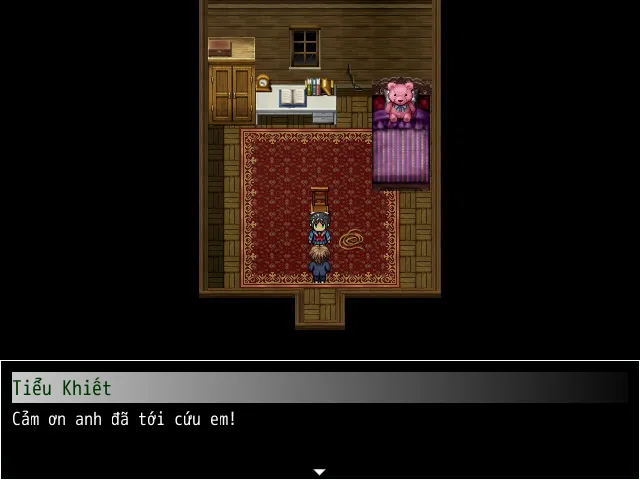
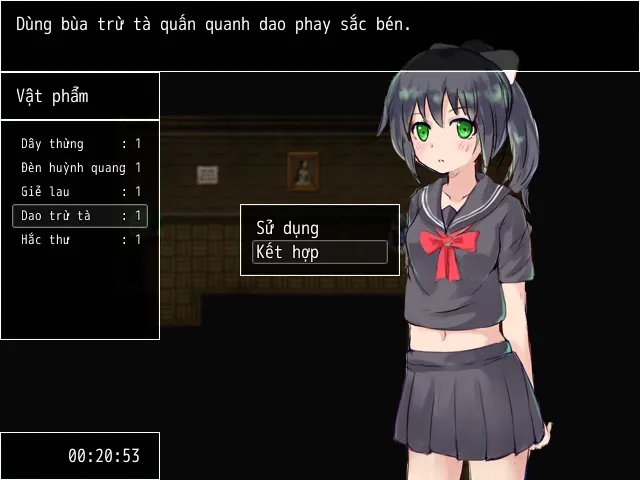
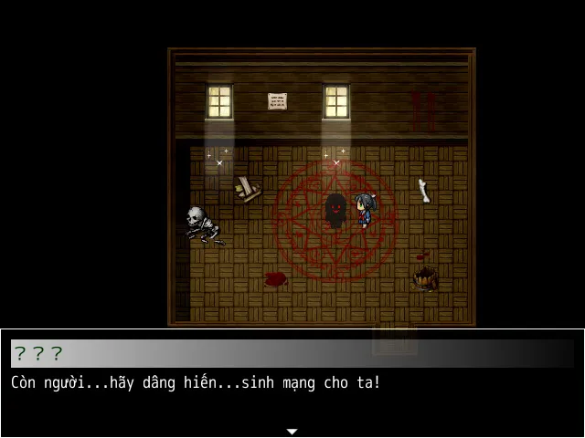

>## [Tải Xuống ⬇️](https://pub-a65f1b60c56f4ebca92f482e387bfa04.r2.dev/Bai%20Ca%20Hy%20Vong.rar) 
---
## 🌟【Lời nói đầu】

Đây là lần thứ ba tôi tham gia.  

Tác phẩm lần này **thuần túy mang tính giải trí**, vì vậy xin đừng đặt quá nhiều kỳ vọng vào cốt truyện.

Ý tưởng này đã nảy ra ngay từ lúc bắt đầu.  

Trong những ngày cuối của sự kiện, mình dùng **1 ngày để nghĩ cốt truyện**, và **2 ngày để lấp các “hố” nội dung**.

Với tâm thế thử sức, mình đã vội vàng chạy nước rút cho kịp deadline.  

Sau khi biết thời hạn được gia hạn, mình lại **vẽ thêm vài bức nữa**.

Nói chung thì… lần này mạch suy nghĩ có hơi hỗn loạn 😆

> Hiện tại vẫn sẽ **tiếp tục chỉnh sửa và cải thiện**,  

> đồng thời **điên cuồng bổ sung thêm CG**.

## 📖【Giới thiệu game】

- Cuộc chiến đương đầu với ác quỷ.
- Cốt truyện tươi sáng và vui vẻ, các câu đố đơn giản và dễ hiểu. Chào mừng đến với trò chơi được tạo ra đặc biệt để chữa lành những người đang mắc chứng điên loạn.
:::note
- Game có nội dung tầm 30p chơi với 3 Ending
:::
## 🖥️【Ảnh chụp màn hình】

## 🎮【Cách điều khiển】

| Tương tác               | Phím bấm
|-------------------------|----------------------------------------------------------------------------------------------------------------------------------------|
| `Di chuyển`             | Phím mũi tên                                                                                                                           |
| `Điều tra / Xác nhận`   | Z / Space                                                                                                                              |
| `Menu / Hủy`            | X / ESC                                                                                                                                |
| `Sử dụng vật phẩm`      | Mở menu → chọn vật phẩm → nhấn phím xác nhận                                                                                           |
| `Tăng tốc`              | Shift                                                                                                                                  |

## ⚠️【【Lưu ý】
:::tip
Không có lưu ý nào cả!
:::
🫰 Cuối cùng chúc mọi người chơi game vui vẻ 0w0