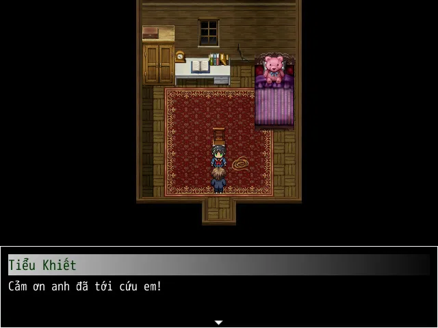
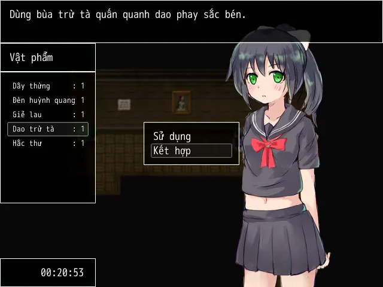
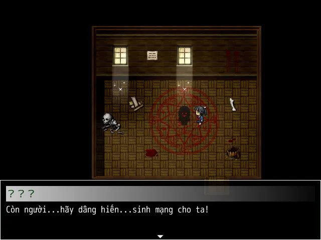

<iframe width="100%" height="468" src="https://www.youtube.com/embed/sFueDBJktL4" title="【BÀI CA HY VỌNG】XANH LÁ KHÔNG XA LÁNH || #FULL | SCHNAVIA GLÜCKLICHKEIT" frameborder="0" allow="accelerometer; autoplay; clipboard-write; encrypted-media; gyroscope; picture-in-picture; web-share" referrerpolicy="strict-origin-when-cross-origin" allowfullscreen></iframe>

>## [Tải Xuống ⬇️](https://pub-a65f1b60c56f4ebca92f482e387bfa04.r2.dev/Bai%20Ca%20Hy%20Vong.rar) 
---
## 📖【Giới thiệu game】

- Cuộc chiến đương đầu với ác quỷ.
- Cốt truyện tươi sáng và vui vẻ, các câu đố đơn giản và dễ hiểu. Chào mừng đến với trò chơi được tạo ra đặc biệt để chữa lành những người đang mắc chứng điên loạn.
:::note
- Game có nội dung tầm 30p chơi với 3 Ending
:::
## 🖥️【Ảnh chụp màn hình】

## 🎮【Cách điều khiển】

| Tương tác               | Phím bấm
|-------------------------|----------------------------------------------------------------------------------------------------------------------------------------|
| `Di chuyển`             | Phím mũi tên                                                                                                                           |
| `Điều tra / Xác nhận`   | Z / Space                                                                                                                              |
| `Menu / Hủy`            | X / ESC                                                                                                                                |
| `Sử dụng vật phẩm`      | Mở menu → chọn vật phẩm → nhấn phím xác nhận                                                                                           |
| `Tăng tốc`              | Shift                                                                                                                                  |

## ⚠️【【Lưu ý】
:::tip
Không có lưu ý nào cả!
:::
🫰 Cuối cùng chúc mọi người chơi game vui vẻ 0w0