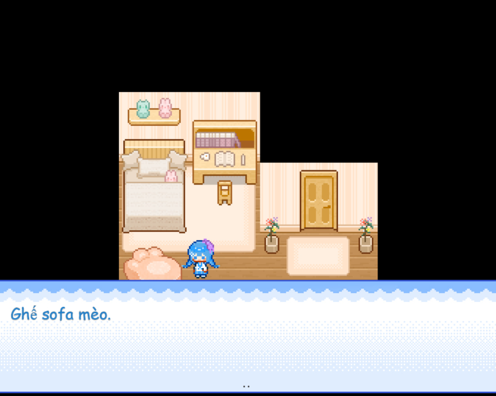
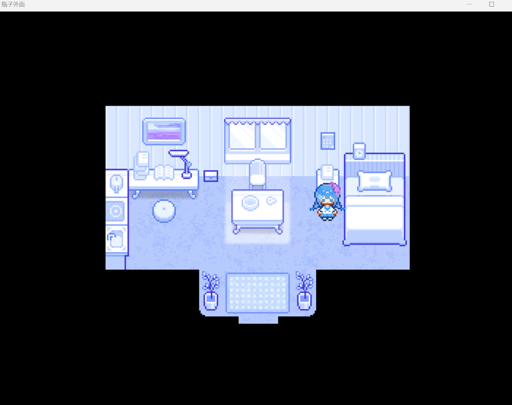
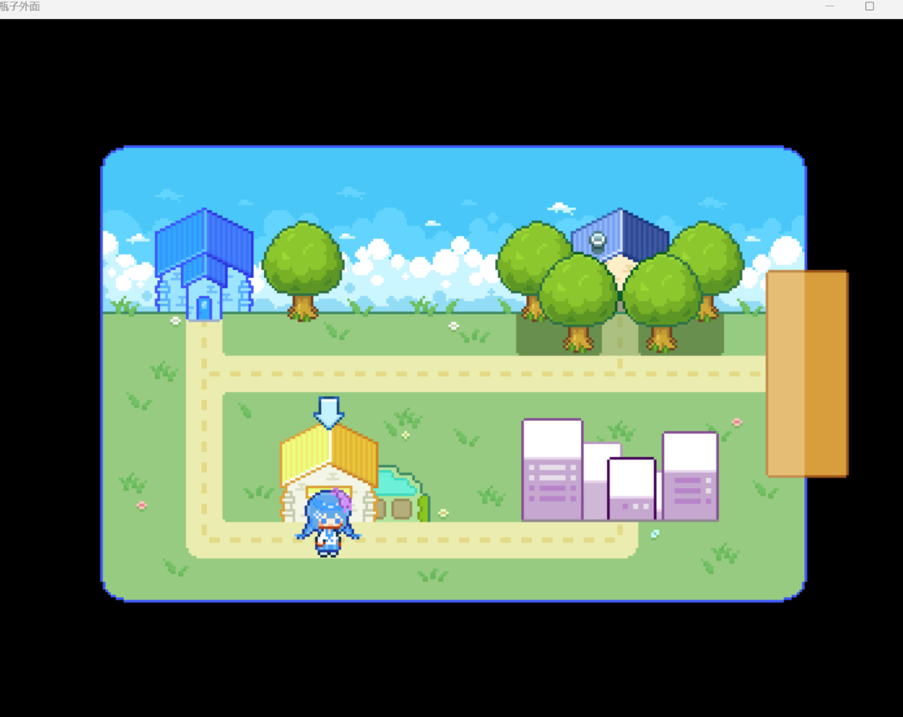
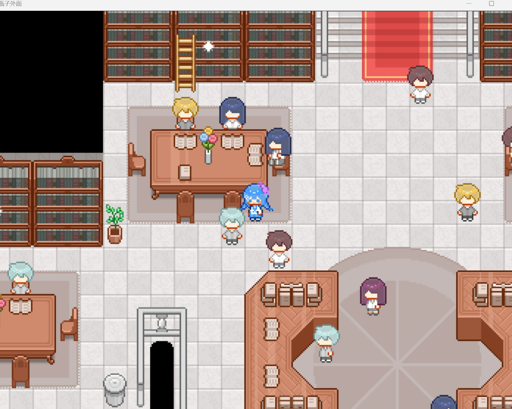

<iframe width="100%" height="468" src="https://www.youtube.com/embed/QBF-rd6oi-k" title="【RM創作大賽實況】【MV/MZ賽道21】《瓶子外面》" frameborder="0" allow="accelerometer; autoplay; clipboard-write; encrypted-media; gyroscope; picture-in-picture; web-share" referrerpolicy="strict-origin-when-cross-origin" allowfullscreen></iframe>

>## [Tải Xuống ⬇️](https://drive.google.com/file/d/1FbN7ewof8HnuMAzytHRI88HLBpO0QKen/view) 
---
## 📖【Giới thiệu game】

- Từ trước đến nay, 蔚来 và mọi người vẫn luôn sống trong một chiếc chai nhỏ bé.    
Một ngày nọ, khi cô cùng người bạn 盈麦 trò chuyện về thế giới bên ngoài, 蔚来 bắt đầu tìm cách để bước ra thế giới ấy…
:::note
- Game có nội dung tầm 1h
:::
## 🖥️【Ảnh chụp màn hình】

## 🎮【Cách điều khiển】

| Tương tác               | Phím bấm
|-------------------------|----------------------------------------------------------------------------------------------------------------------------------------|
| `Di chuyển`             | Phím mũi tên                                                                                                                           |
| `Điều tra / Xác nhận`   | Z / Space                                                                                                                              |
| `Menu / Hủy`            | X / ESC                                                                                                                                |
| `Sử dụng vật phẩm`      | Mở menu → chọn vật phẩm → nhấn phím xác nhận                                                                                           |
| `Tăng tốc`              | Shift                                                                                                                                  |

## ⚠️【Lưu ý】
:::tip
Nếu lỗi font hay cài font game vào máy tính!
:::
🫰 Cuối cùng chúc mọi người chơi game vui vẻ 0w0