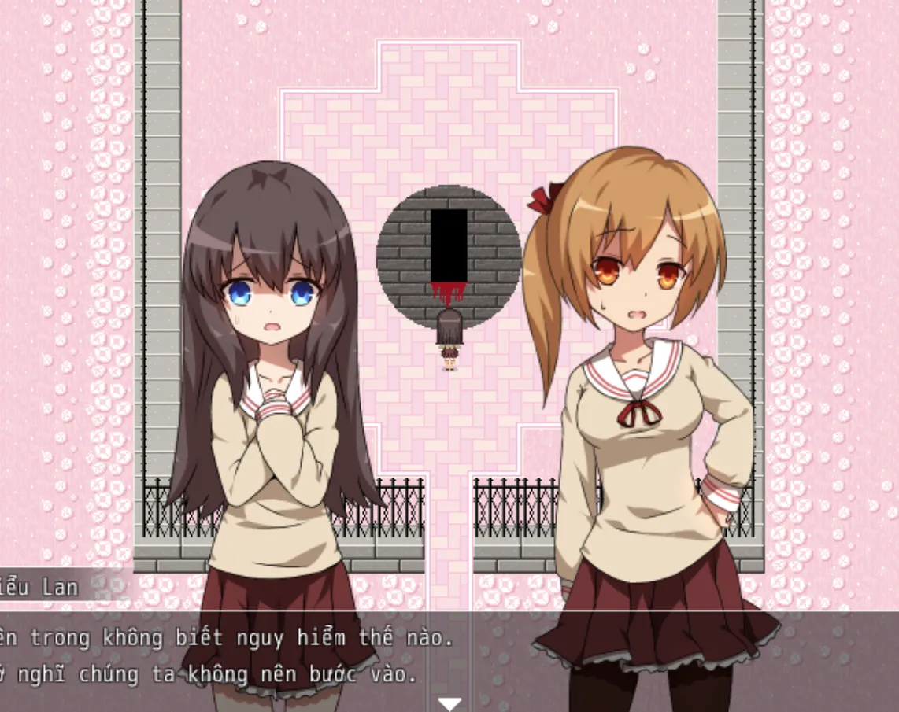

>## [Tải Xuống](https://drive.google.com/file/d/19kg0PmZ3kr8c5mWryVdwhIzmtb25clgg/view) ⬇️
---
## 【Giới thiệu game】

- Nội dung của trò chơi này không liên quan đến bất kỳ cá nhân, nhóm hoặc sự kiện nào trong thế giới thực.
- Game có nội dung tầm 30p chơi với 5 Ending

## 【Giới thiệu nhân vật】

## 【Ảnh chụp màn hình】

## 【Cách điều khiển】

- Di chuyển: Phím mũi tên  
- Điều tra / Xác nhận: Z / Space  
- Menu / Hủy: X / ESC  
- Sử dụng vật phẩm: Mở menu → chọn vật phẩm → nhấn phím xác nhận  
- Tăng tốc: Shift  

## Hướng dẫn giải đố (Dành cho người không giỏi giải mật)

1. **Bia mộ**:  
   Làm theo gợi ý trên tấm bảng gỗ để lần lượt nhấn vào các bia mộ.  
   Bia cuối cùng là **một trong ba bia mộ bị hư hỏng**.

2. **Thời gian**:  
   Xem bản đồ như một chiếc **đồng hồ**, tìm giá trị tương ứng, sau đó có thể tìm thấy vật cần thiết **trên mặt đất**.

3. **Vật cần tìm**:  
   - Người bận rộn → đưa **đồng hồ**  
   - Người nghèo → đưa **tiền** (tiền nằm ở nơi **đã từng xuất hiện chữ “tiền”**)  
   - Người cô đơn → đưa **bạn bè** (ở **hai bên**)

4. **Ngôi mộ vô danh**:  
   Đi vòng quanh ngôi mộ **theo chiều kim đồng hồ một vòng**,  
   sau đó đi **ngược chiều kim đồng hồ một vòng**.

5. **Tang lễ của bố**:  
   Đổi **tất cả hoa thành màu trắng**, sau đó giải theo **thứ tự nhất định**.

6. **Chai rượu vỡ**:  
   Tìm tất cả các chai rượu  
   (một chai ở **dưới bàn**, một chai ở **trong bức tranh**),  
   sau đó **đập vỡ chúng trên chất lỏng màu đỏ**.

7. **Cô lập**:  
   Tô đen **tất cả các bức chân dung**.

8. **Bắt nạt**:  **Đẩy các bạn học**.

9. **Trốn tìm**:  **Mở cánh cửa cuối cùng**.

10. **Suy nghĩ**:  
    Ngồi yên và **chờ vài chục giây**.

11. **Kết thúc**: (Bỏ qua)

12. **Trái tim nhìn thấy nhưng không chạm được**:  
    **Trên tường có một cái lỗ**.

13. **Khu vườn màu hồng**:  
    Chọn **một trong hai**:  
    **máy cắt cỏ** hoặc **bình tưới nước**,  
    rồi **dọn sạch toàn bộ hoa**

Cuối cùng chúc mọi người chơi game vui vẻ 0w0