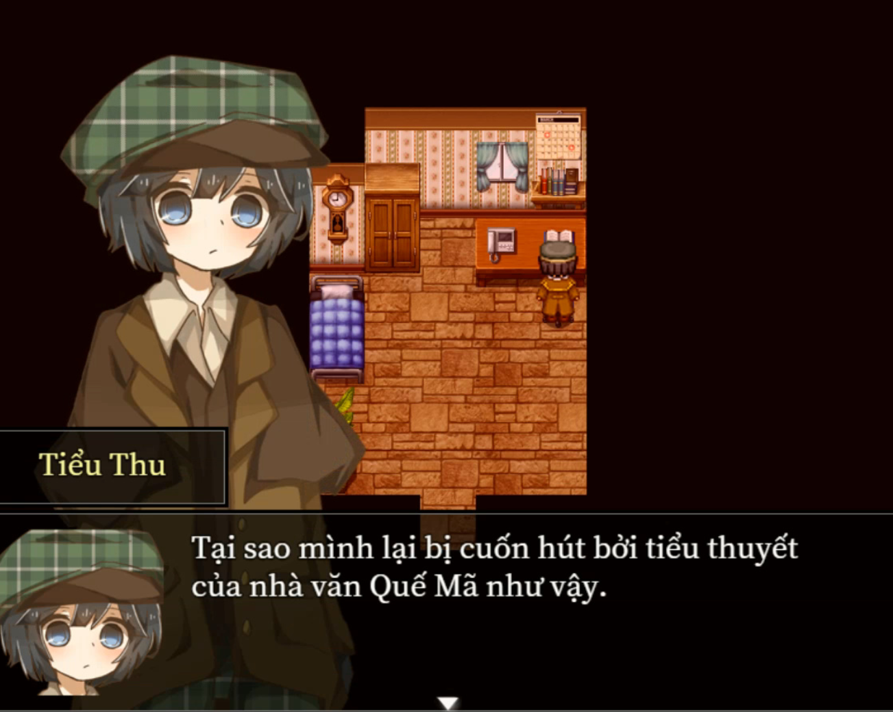
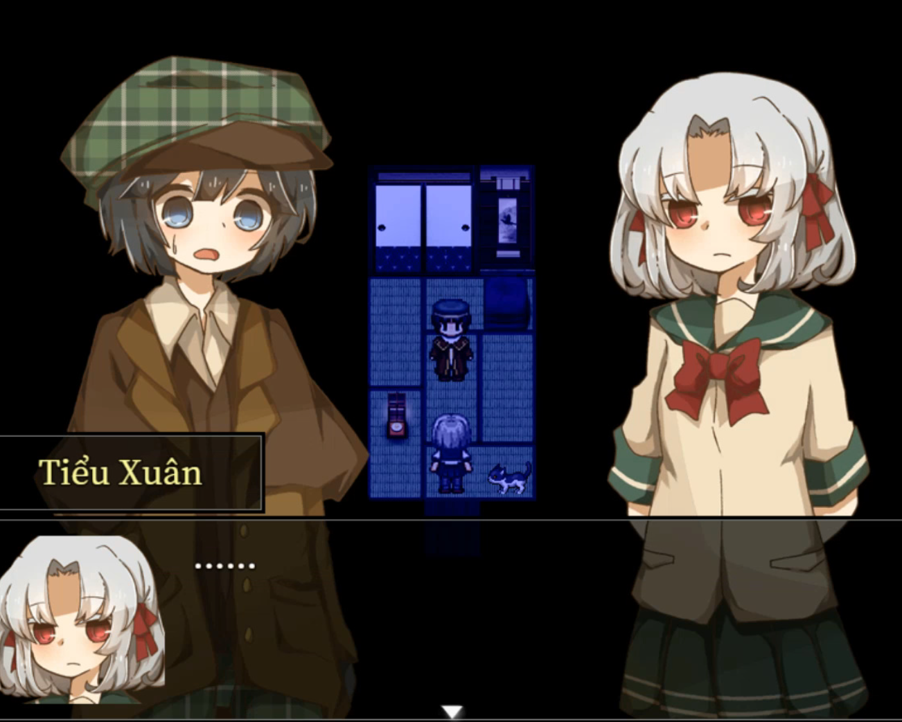

<iframe width="100%" height="468" src="https://www.youtube.com/embed/PojJm4NopMc" title="【CÂU CHUYỆN DƯỚI BÓNG HOÀNG HÔN  - VIỆT HOÁ】GAME TÌNH CẢM NHẸ NHÀNG THƯ GIÃN || #1" frameborder="0" allow="accelerometer; autoplay; clipboard-write; encrypted-media; gyroscope; picture-in-picture; web-share" referrerpolicy="strict-origin-when-cross-origin" allowfullscreen></iframe>

>## [Tải Xuống ⬇️ (Tên Nhân Vật Tiếng Việt)](https://drive.google.com/file/d/1NJjtbh9GHUgodzAeTnmDzh1ISQLgufOK/view) 
>## [Tải Xuống ⬇️ (Tên Nhân Vật Tiếng Nhật)](https://drive.google.com/file/d/1te8VYXuvirR6m12OYMm9OhtOaKhlTS8m/view) 
---
## 📖【Giới thiệu game】

- Một ngày nọ, cậu thiếu niên yêu tiểu thuyết tên Akino nhận được một cuộc gọi từ một cô gái.   
"Lời hứa."   
Chỉ để lại duy nhất từ đó, cuộc gọi đột ngột ngắt.   
Trong lồng ngực Akino dâng lên một linh cảm chẳng lành.
:::note
- Game có nội dung tầm 2-3h chơi.
:::
## 🖥️【Ảnh chụp màn hình】

## 🎮【Cách điều khiển】

| Tương tác               | Phím bấm
|-------------------------|----------------------------------------------------------------------------------------------------------------------------------------|
| `Di chuyển`             | Phím mũi tên                                                                                                                           |
| `Điều tra / Xác nhận`   | Z / Space                                                                                                                              |
| `Menu / Hủy`            | X / ESC                                                                                                                                |
| `Sử dụng vật phẩm`      | Mở menu → chọn vật phẩm → nhấn phím xác nhận                                                                                           |
| `Tăng tốc`              | Shift                                                                                                                                  |

## ⚠️【Lưu ý】
:::tip
Nếu lỗi font hay cài font game vào máy tính!
:::
🫰 Cuối cùng chúc mọi người chơi game vui vẻ 0w0