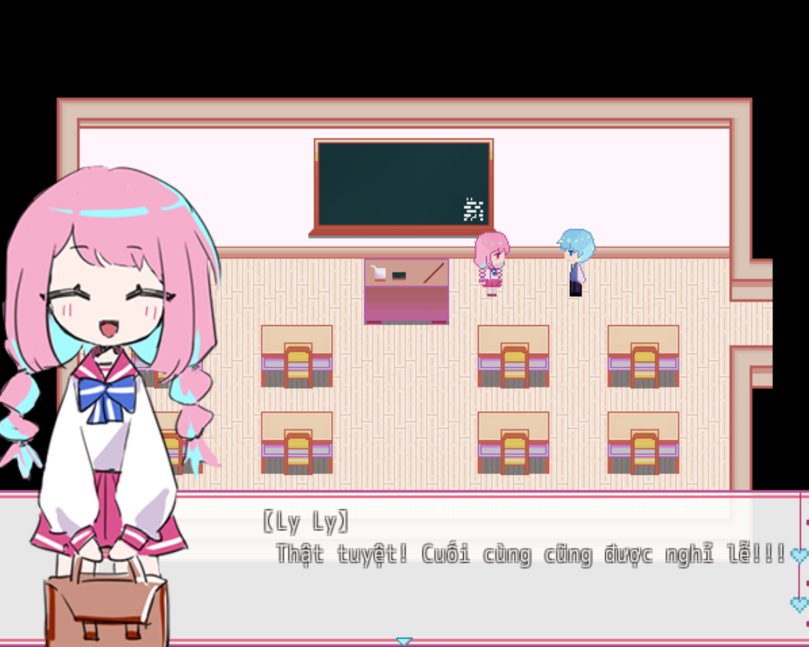
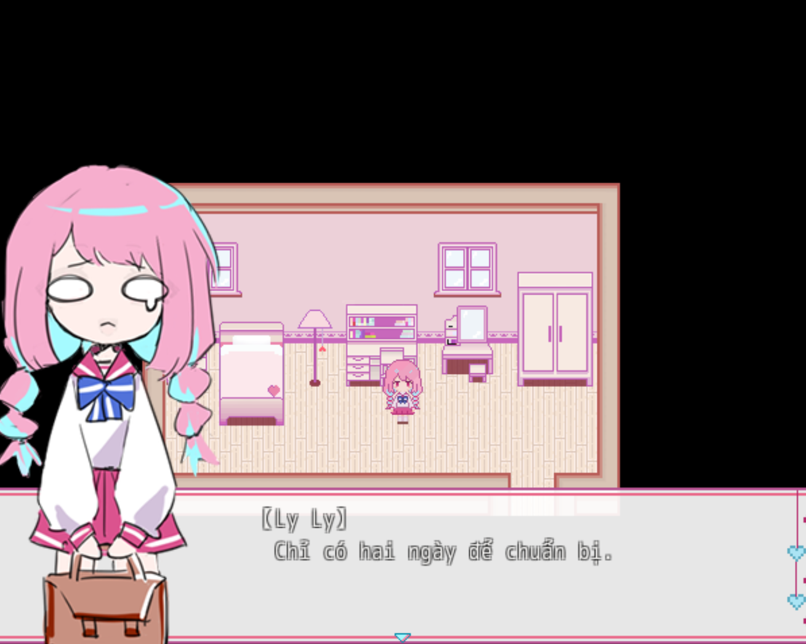
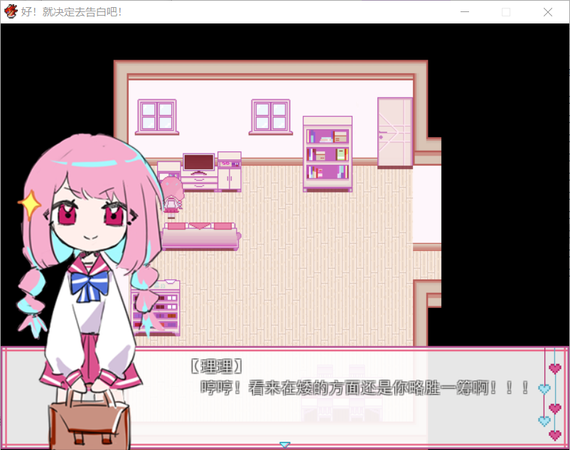

<iframe width="100%" height="468" src="https://www.youtube.com/embed/56k2f3LK01w" title="[Việt Hóa] Chỉ Cần Tỏ Tình Là Đồng Ý - Game Nhẹ Nhàng Sau Một Tuần Bị Hành Xác Của Mình!" frameborder="0" allow="accelerometer; autoplay; clipboard-write; encrypted-media; gyroscope; picture-in-picture; web-share" referrerpolicy="strict-origin-when-cross-origin" allowfullscreen></iframe>

>## [Tải Xuống ⬇️](https://drive.google.com/file/d/1IbEn-Ov_NXQVPXY1ZhEsY3ASuP1GnqPy/view) 

---
## 📖【Giới thiệu game】

- Câu chuyện ngôn tình về tình yêu học trò khi nhân vật nữ quyết định tỏ tình với nhân vật nam.  
:::note
- Game có nội dung tầm 20p chơi với 2 ending.
:::
## 🖥️【Ảnh chụp màn hình】

## 🎮【Cách điều khiển】

| Tương tác               | Phím bấm
|-------------------------|----------------------------------------------------------------------------------------------------------------------------------------|
| `Di chuyển`             | Phím mũi tên                                                                                                                           |
| `Điều tra / Xác nhận`   | Z / Space                                                                                                                              |
| `Menu / Hủy`            | X / ESC                                                                                                                                |
| `Sử dụng vật phẩm`      | Mở menu → chọn vật phẩm → nhấn phím xác nhận                                                                                           |
| `Tăng tốc`              | Shift                                                                                                                                  |

## ⚠️【Lưu ý】
:::tip
Nếu lỗi font hay cài font game vào máy tính!
:::
🫰 Cuối cùng chúc mọi người chơi game vui vẻ 0w0