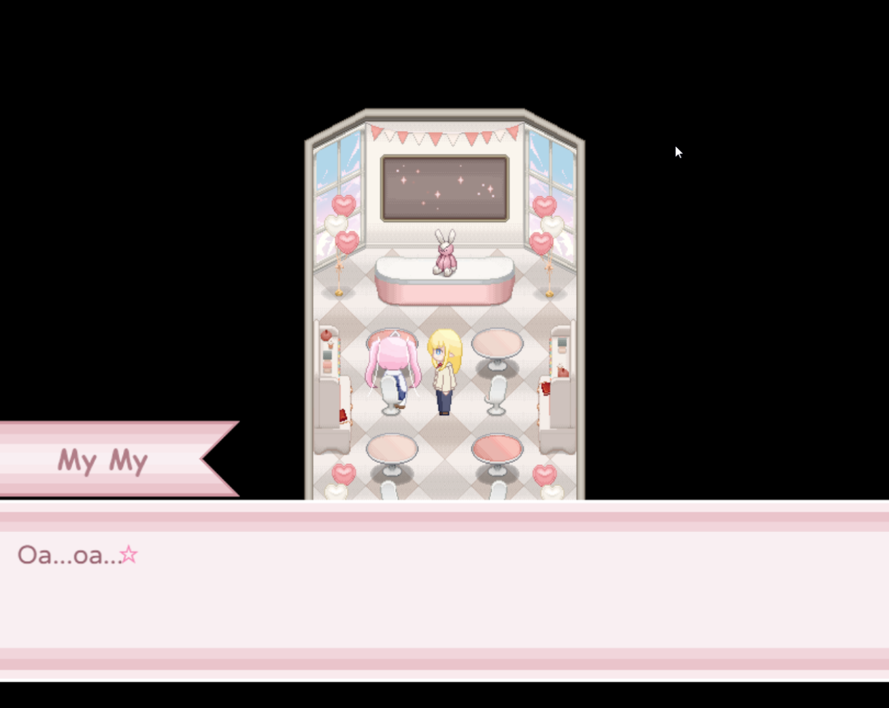
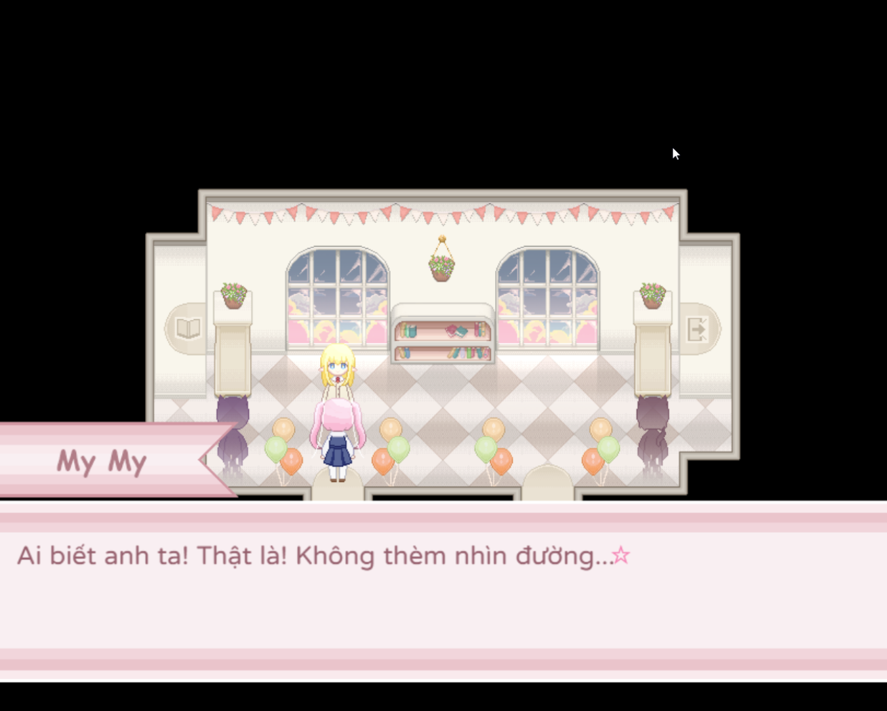

<iframe width="100%" height="468" src="https://www.youtube.com/embed/8-W2mIl9LBE" title="【CÓ PHẢI HỆ THỐNG NÀY LỖI】TÌNH YÊU GÀ BÔNG CHÍT CHÍT MEO MEO | SCHNAVIA GLÜCKLICHKEIT" frameborder="0" allow="accelerometer; autoplay; clipboard-write; encrypted-media; gyroscope; picture-in-picture; web-share" referrerpolicy="strict-origin-when-cross-origin" allowfullscreen></iframe>

>## [Tải Xuống ⬇️](https://drive.google.com/file/d/1F96wsOHaqx_pRnwPTqcDjO3EslAkoW0-/view) 

---
## 📖【Giới thiệu game】

- My My nhận được bài tập làm văn về nhà có tựa đề "Món quà quý giá nhất".  Đồng thời cô bất chợt có khả năng đặc biệt nhìn được chỉ số cảm xúc của người khác đối với mình. Liệu My My sẽ làm bài văn như thế nào?
:::note
- Game có nội dung tầm 30p chơi với 1 ending.
:::
## 🖥️【Ảnh chụp màn hình】

## 🎮【Cách điều khiển】

| Tương tác               | Phím bấm
|-------------------------|----------------------------------------------------------------------------------------------------------------------------------------|
| `Di chuyển`             | Phím mũi tên                                                                                                                           |
| `Điều tra / Xác nhận`   | Z / Space                                                                                                                              |
| `Menu / Hủy`            | X / ESC                                                                                                                                |
| `Sử dụng vật phẩm`      | Mở menu → chọn vật phẩm → nhấn phím xác nhận                                                                                           |
| `Tăng tốc`              | Shift                                                                                                                                  |

## ⚠️【Lưu ý】
:::tip
Nếu lỗi font hay cài font game vào máy tính!
:::
🫰 Cuối cùng chúc mọi người chơi game vui vẻ 0w0