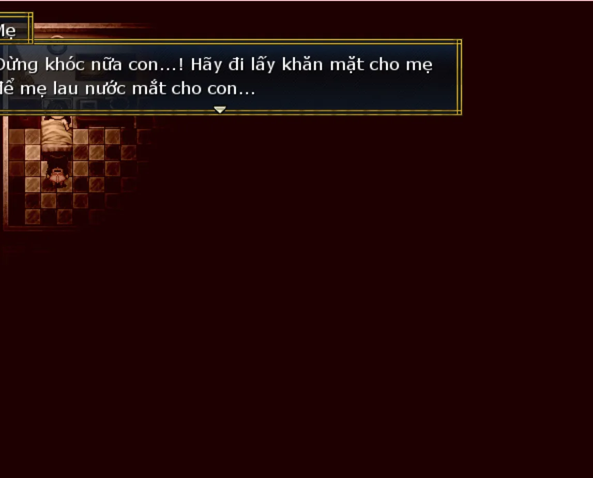
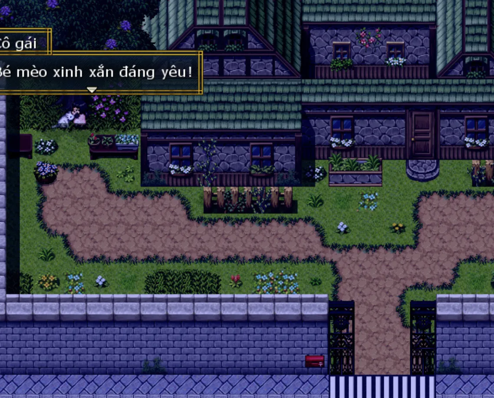

>## [Tải Xuống](https://drive.google.com/file/d/10NE_oyE9gscrLxf8TLg09VDwNCjkChnC/view) ⬇️
---
## 【Giới thiệu game】

- Đinh Hương là một trò chơi tình cảm gia đình.
- Lời tác giả: Tác phẩm này về cơ bản có thể nói là một kịch bản thuần R, và mạch cốt truyện thì không dài, thậm chí có thể nói là khá ngắn. (︶︿︶)
- Game có nội dung tầm 10p chơi với 1 Ending

## 【Ảnh chụp màn hình】

## 【Cách điều khiển】

- Di chuyển: Phím mũi tên  
- Điều tra / Xác nhận: Z / Space  
- Menu / Hủy: X / ESC  
- Sử dụng vật phẩm: Mở menu → chọn vật phẩm → nhấn phím xác nhận  
- Tăng tốc: Shift  

## 【Lưu ý】

Không có lưu ý nào cả!

Cuối cùng chúc mọi người chơi game vui vẻ 0w0