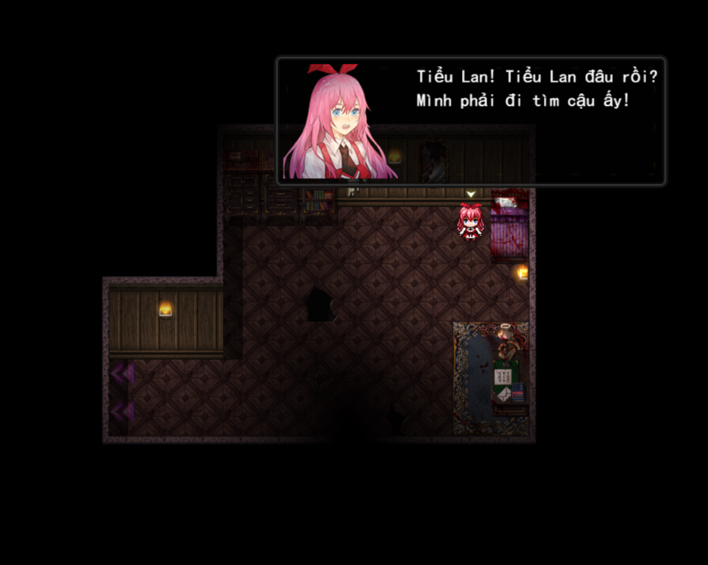
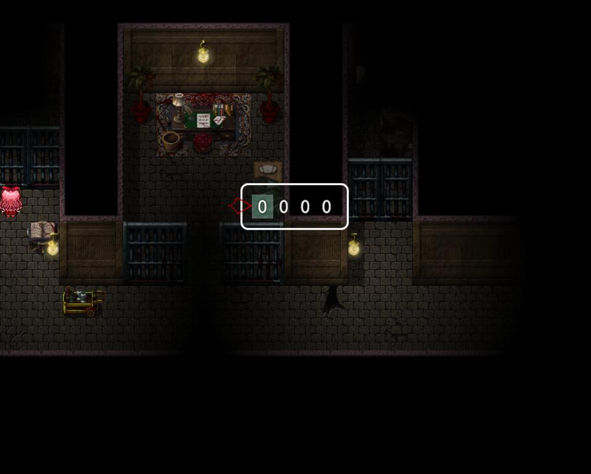
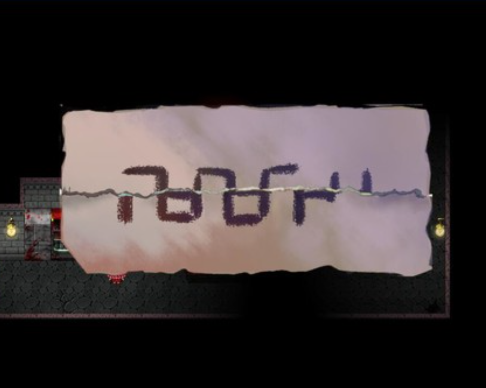

>## [Tải Xuống ⬇️ (cần có file gốc mới chạy được bản việt hoá, hãy mua game trên Steam)](https://drive.google.com/file/d/15YnpgviEvUZsHeea1T1bVqVY5DPfAM6s/view) 
---
## 📖【Giới thiệu game】

- Cô bé quàng khăn đỏ và cô bé xanh là đôi bạn thân. Một tai nạn khiến cả hai rơi xuống vách đá. Khi tỉnh dậy, họ thấy mình bị bao vây bởi những con quái vật đáng sợ, những bộ xương hoang tàn và những cạm bẫy nguy hiểm khắp nơi... Liệu họ có thể thoát khỏi đây?
:::note
- Game có nội dung tầm 1-2h chơi
:::
## 🖥️【Ảnh chụp màn hình】

## 🎮【Cách điều khiển】

| Tương tác               | Phím bấm
|-------------------------|----------------------------------------------------------------------------------------------------------------------------------------|
| `Di chuyển`             | Phím mũi tên                                                                                                                           |
| `Điều tra / Xác nhận`   | Z / Space                                                                                                                              |
| `Menu / Hủy`            | X / ESC                                                                                                                                |
| `Sử dụng vật phẩm`      | Mở menu → chọn vật phẩm → nhấn phím xác nhận                                                                                           |
| `Tăng tốc`              | Shift                                                                                                                                  |

## ⚠️【Lưu ý】
:::tip
Nếu lỗi font hay cài font game vào máy tính!   
cần có file gốc mới chạy được bản việt hoá, hãy mua game trên Steam
:::
🫰 Cuối cùng chúc mọi người chơi game vui vẻ 0w0