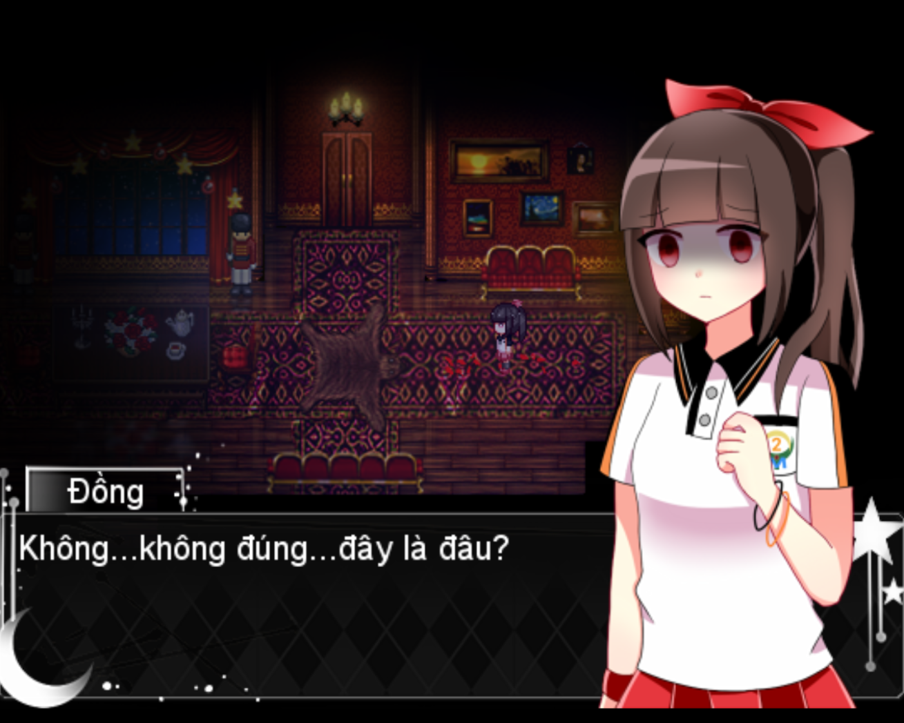
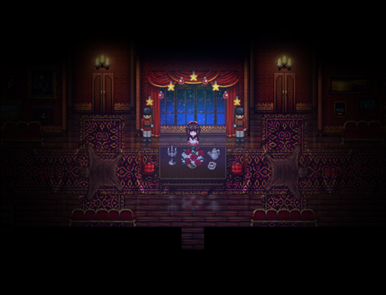
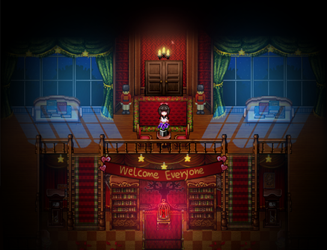
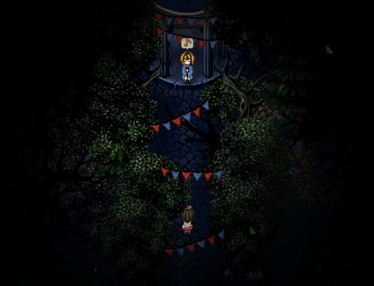

<iframe width="100%" height="468" src="https://www.youtube.com/embed/PQsXJZv2268" title="[Heart Knot demo - Việt hóa] Chào em gái đáng yêu || #Full" frameborder="0" allow="accelerometer; autoplay; clipboard-write; encrypted-media; gyroscope; picture-in-picture; web-share" referrerpolicy="strict-origin-when-cross-origin" allowfullscreen></iframe>

>## [Tải Xuống ⬇️](https://drive.google.com/file/d/1h9GpSuRC3LrVlg4K1P7adUF2tvcmKdXo/view) 

---
## 📖【Giới thiệu game】

- Đồng là một học sinh trung học cơ sở. Một ngày nọ, cô thức dậy trong phòng như thường lệ. Khi chuẩn bị đến trường, cô chợt nhận thấy mọi thứ trong nhà đều đã thay đổi. Cô không muốn bị trễ học nên quyết định kiểm tra xung quanh xem có chuyện gì đang xảy ra.
:::note
- Game có nội dung tầm 1h chơi với 1 ending.
:::
## 🖥️【Ảnh chụp màn hình】

## 🎮【Cách điều khiển】

| Tương tác               | Phím bấm
|-------------------------|----------------------------------------------------------------------------------------------------------------------------------------|
| `Di chuyển`             | Phím mũi tên                                                                                                                           |
| `Điều tra / Xác nhận`   | Z / Space                                                                                                                              |
| `Menu / Hủy`            | X / ESC                                                                                                                                |
| `Sử dụng vật phẩm`      | Mở menu → chọn vật phẩm → nhấn phím xác nhận                                                                                           |
| `Tăng tốc`              | Shift                                                                                                                                  |

## ⚠️【Lưu ý】
:::tip
Nếu lỗi font hay cài font game vào máy tính!
:::
🫰 Cuối cùng chúc mọi người chơi game vui vẻ 0w0