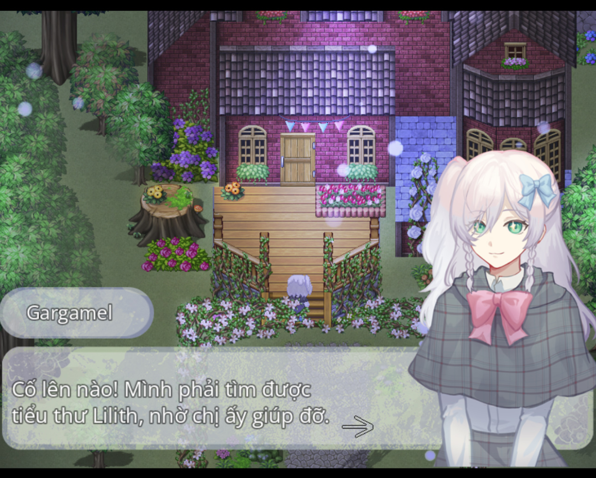
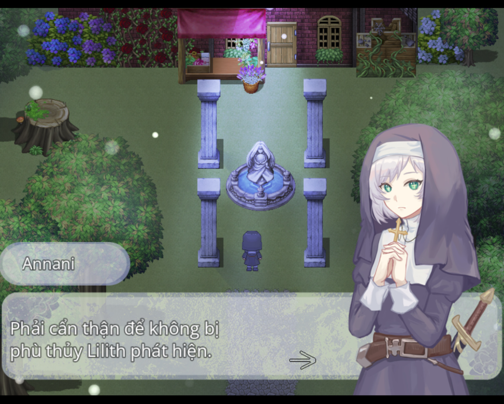
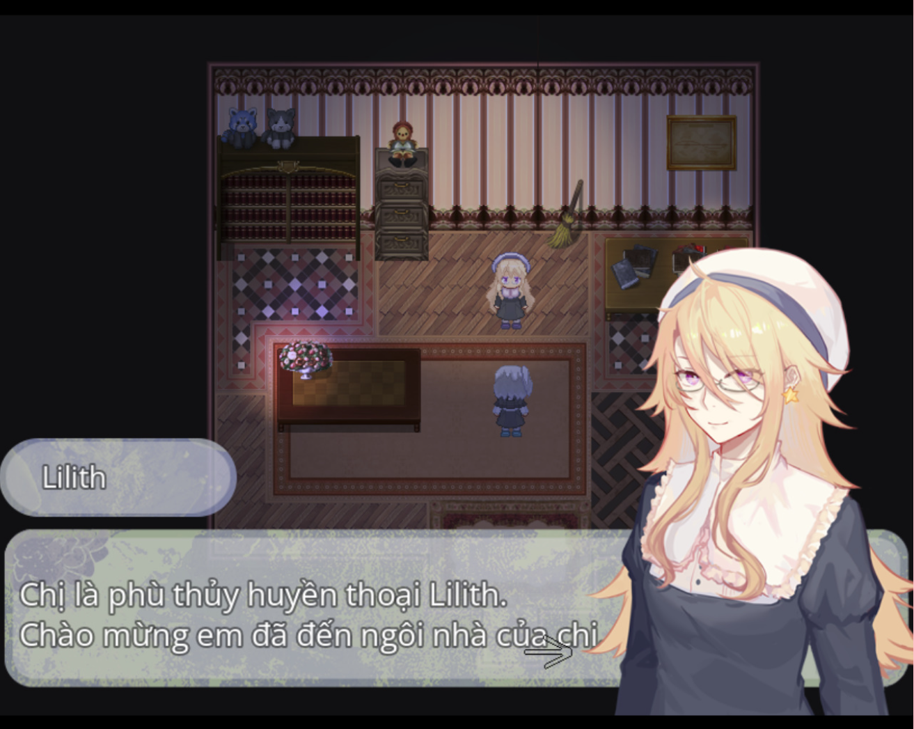

>## [Tải Xuống ⬇️](https://drive.google.com/file/d/1L-QqUhjVpUEGFd6VqQX9icM0o5brgUFP/view) 

---
## 📖【Giới thiệu game】

- Đó là một câu chuyện xảy ra từ rất lâu, rất lâu về trước.   

   Căn nhà của ma nữ nằm sâu trong khu rừng ngày nọ đã đón tiếp hai vị khách.   

   Một người bước vào từ cửa trước, một người đi vào từ cửa sau.   
   Một là tiểu ma nữ gargamel đang chạy trốn đến nơi này,   
   người còn lại là nữ tu kỵ sĩ Annani, kẻ muốn nắm được điểm yếu của ma nữ.   

   Liệu họ có thể đạt được mục đích của riêng mình hay không?   

   Còn ma nữ Lilith… rốt cuộc lại là người thế nào?   

   Và rồi, câu chuyện chính thức mở màn.    
:::note
- Game có nội dung tầm 15p chơi với 1 ending.
:::
## 🖥️【Ảnh chụp màn hình】

## 🎮【Cách điều khiển】

| Tương tác               | Phím bấm
|-------------------------|----------------------------------------------------------------------------------------------------------------------------------------|
| `Di chuyển`             | Phím mũi tên                                                                                                                           |
| `Điều tra / Xác nhận`   | Z / Space                                                                                                                              |
| `Menu / Hủy`            | X / ESC                                                                                                                                |
| `Sử dụng vật phẩm`      | Mở menu → chọn vật phẩm → nhấn phím xác nhận                                                                                           |
| `Tăng tốc`              | Shift                                                                                                                                  |

## ⚠️【Lưu ý】
:::tip
Nếu lỗi font hay cài font game vào máy tính!
:::
🫰 Cuối cùng chúc mọi người chơi game vui vẻ 0w0