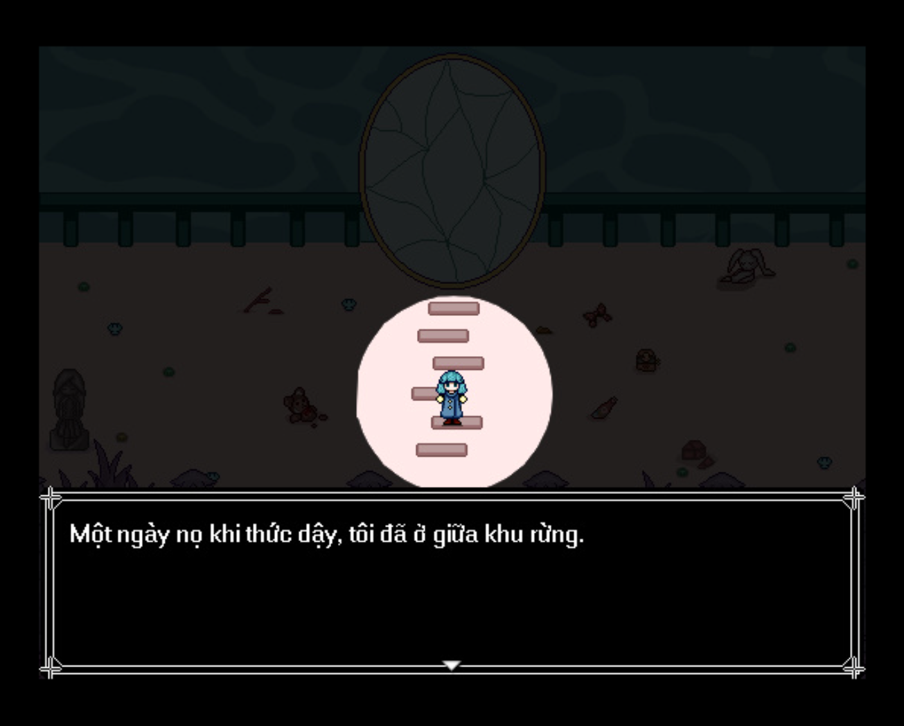
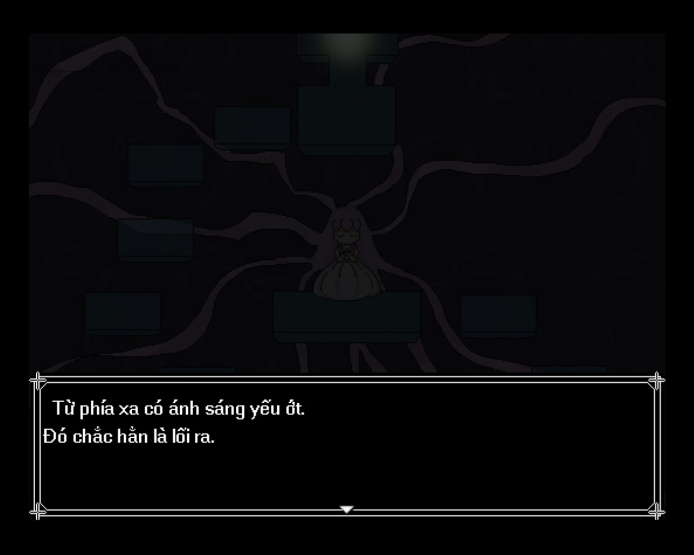

<iframe width="100%" height="468" src="https://www.youtube.com/embed/829reDYnB2w" title="无光的森林 (Việt Hóa) - Khu Rừng Không Có Ánh Sáng" frameborder="0" allow="accelerometer; autoplay; clipboard-write; encrypted-media; gyroscope; picture-in-picture; web-share" referrerpolicy="strict-origin-when-cross-origin" allowfullscreen></iframe>

>## [Tải Xuống ⬇️](https://drive.google.com/file/d/10lmPecJq4gFj-9_p7FcxoZ88xuB0M5ps/view) 

---
## 📖【Giới thiệu game】

- “Khi con trưởng thành rồi, hãy rời khỏi khu rừng không ánh sáng này càng sớm càng tốt.”   
   Từ nhỏ đến lớn, những người lớn đều dặn cô như thế.   
   “Sức mạnh của các vị thần cổ đại đang trú ngụ trong những chiếc thẻ sách này. Nhất định phải mang chúng rời khỏi nơi đây.”   
   Vì vậy, cô gái nhỏ cầm lấy ba chiếc thẻ sách, bắt đầu chuyến hành trình ngắn ngủi rời xa quê hương.   
:::note
- Game có nội dung tầm 15p chơi với 2 ending.
:::
## 🖥️【Ảnh chụp màn hình】

## 🎮【Cách điều khiển】

| Tương tác               | Phím bấm
|-------------------------|----------------------------------------------------------------------------------------------------------------------------------------|
| `Di chuyển`             | Phím mũi tên                                                                                                                           |
| `Điều tra / Xác nhận`   | Z / Space                                                                                                                              |
| `Menu / Hủy`            | X / ESC                                                                                                                                |
| `Sử dụng vật phẩm`      | Mở menu → chọn vật phẩm → nhấn phím xác nhận                                                                                           |
| `Tăng tốc`              | Shift                                                                                                                                  |

## ⚠️【Lưu ý】
:::tip
Nếu lỗi font hay cài font game vào máy tính!
:::
🫰 Cuối cùng chúc mọi người chơi game vui vẻ 0w0