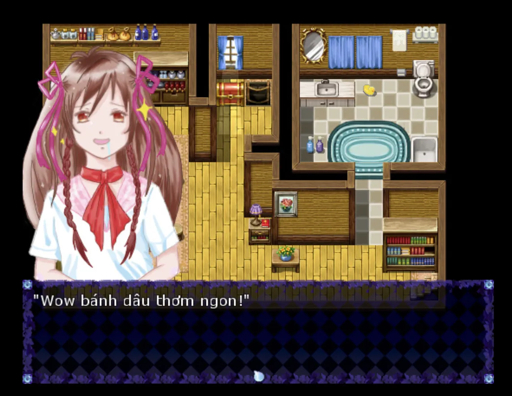
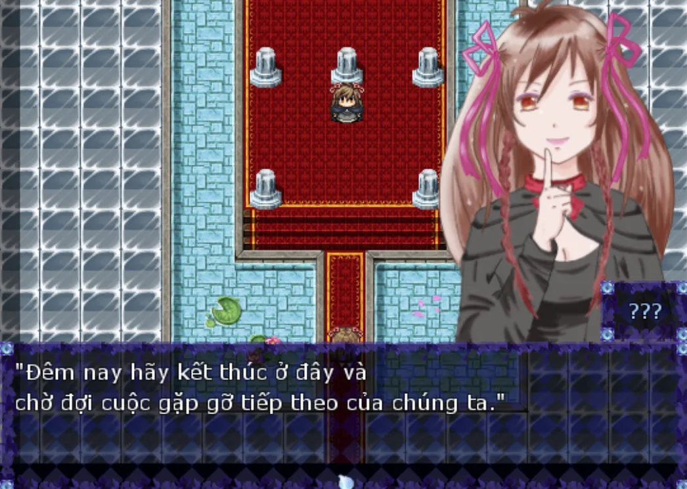
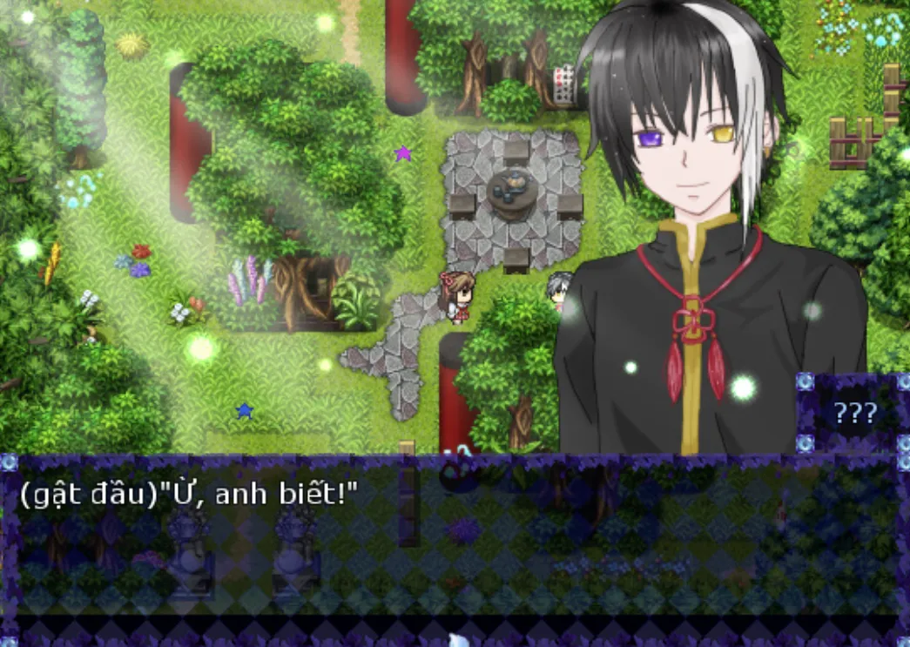

>## [Tải Xuống ⬇️](https://drive.google.com/file/d/10V-kfYWWs5n-3FI0j9hIjvZ0r3fhM7YZ/view)
---
## 【Giới thiệu game】

Khi trăng đêm rơi lệ, 
Hương vàng óng ả lan trôi trong gió, 
Cô gái bị vây quanh bởi sắc đỏ thẫm. 
 
Nàng bước lên con đường lát đá rực rỡ, 
trong vòng tay thì thầm của sóng biển, 
Những cánh bướm dẫn lối nàng 
Trở về nơi ký ức dừng chân an nghỉ. 
 
Đây là một câu chuyện 
Về hành trình tìm kiếm chân tướng 
Giữa ranh giới mong manh của thực tại và giấc mơ...

## 【Giới thiệu nhân vật】

- Game có nội dung tầm 4h chơi với 5 Ending

## 【Ảnh chụp màn hình】

## 【Cách điều khiển】

- Di chuyển: Phím mũi tên  
- Điều tra / Xác nhận: Z / Space  
- Menu / Hủy: X / ESC  
- Sử dụng vật phẩm: Mở menu → chọn vật phẩm → nhấn phím xác nhận  
- Tăng tốc: Shift  

## 【Lưu ý】

Không có lưu ý nào cả!

🫰 Cuối cùng chúc mọi người chơi game vui vẻ 0w0