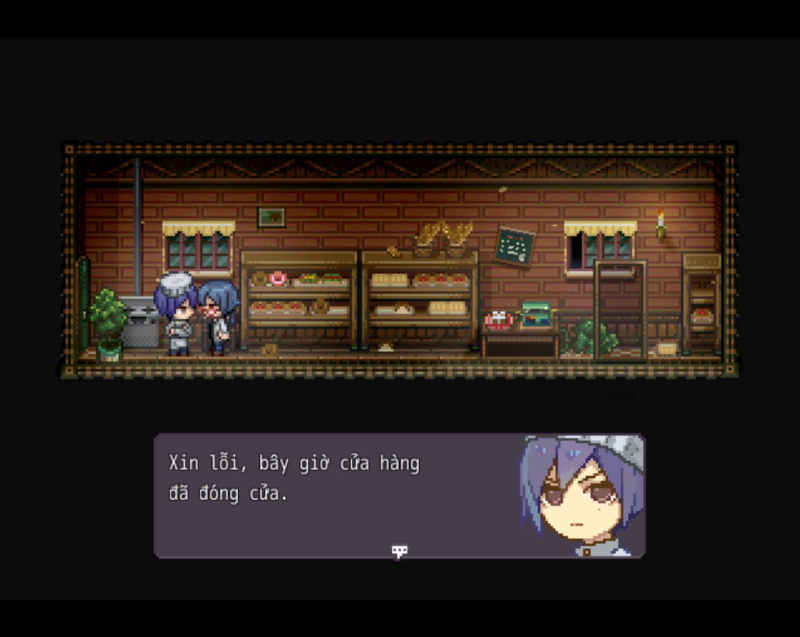
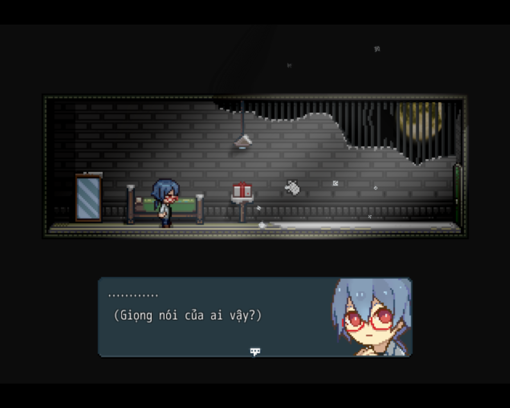
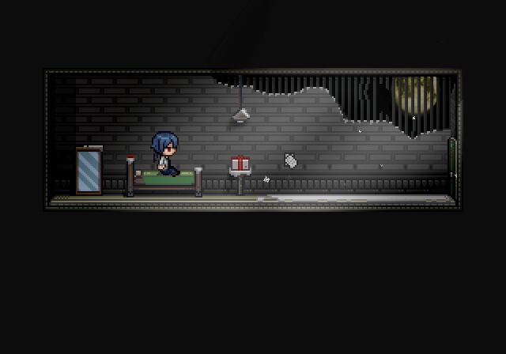
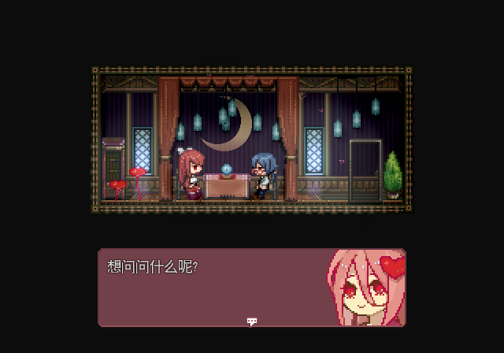
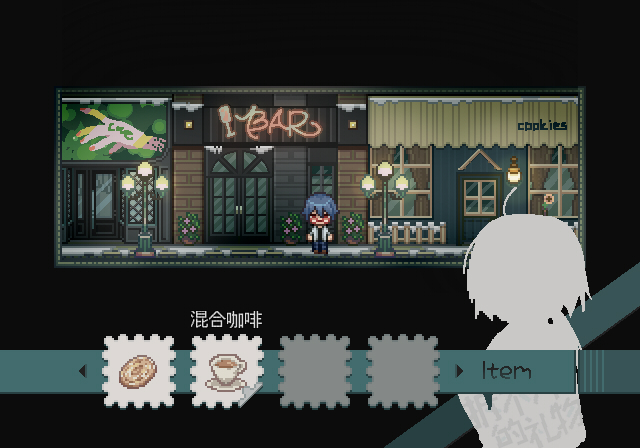
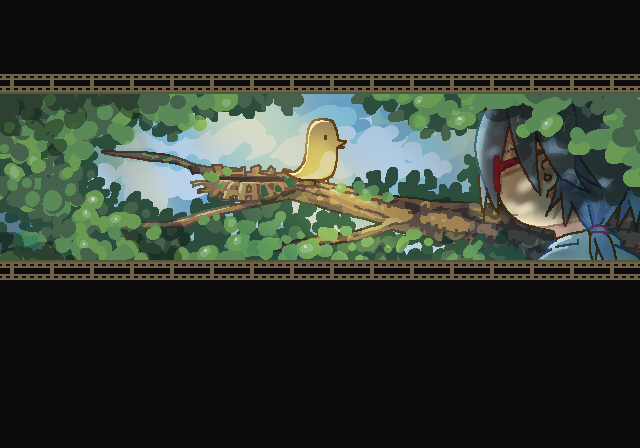

<iframe width="100%" height="468" src="https://www.youtube.com/embed/hdv2lYhSgU8" title="[Món Quà Không Thể Mở Được - Việt hoá] Kịch bản mở quà bằng bút thay vì thử dùng kéo || #Full" frameborder="0" allow="accelerometer; autoplay; clipboard-write; encrypted-media; gyroscope; picture-in-picture; web-share" referrerpolicy="strict-origin-when-cross-origin" allowfullscreen></iframe>

>## [Tải Xuống ⬇️](https://drive.google.com/file/d/1_AvfH2GBItZh0xKW4Efh0U0UO2w22BVR/view) 

---
## 📖【Giới thiệu game】

- Lan Lan là một cậu bé cận thị. Một ngày nọ, cậu đang ngủ thì nghe thấy giọng nói lạ gọi dậy. Tỉnh dậy cậu thấy trên bàn có một món quà sinh nhật nhưng nó không thể nào mở được.
:::note
- Game có nội dung tầm 0,5h chơi với 1 ending.
:::
## 🖥️【Ảnh chụp màn hình】

## 🎮【Cách điều khiển】

| Tương tác               | Phím bấm
|-------------------------|----------------------------------------------------------------------------------------------------------------------------------------|
| `Di chuyển`             | Phím mũi tên                                                                                                                           |
| `Điều tra / Xác nhận`   | Z / Space                                                                                                                              |
| `Menu / Hủy`            | X / ESC                                                                                                                                |
| `Sử dụng vật phẩm`      | Mở menu → chọn vật phẩm → nhấn phím xác nhận                                                                                           |
| `Tăng tốc`              | Shift                                                                                                                                  |

## ⚠️【Lưu ý】
:::tip
Nếu lỗi font hay cài font game vào máy tính!
:::
🫰 Cuối cùng chúc mọi người chơi game vui vẻ 0w0