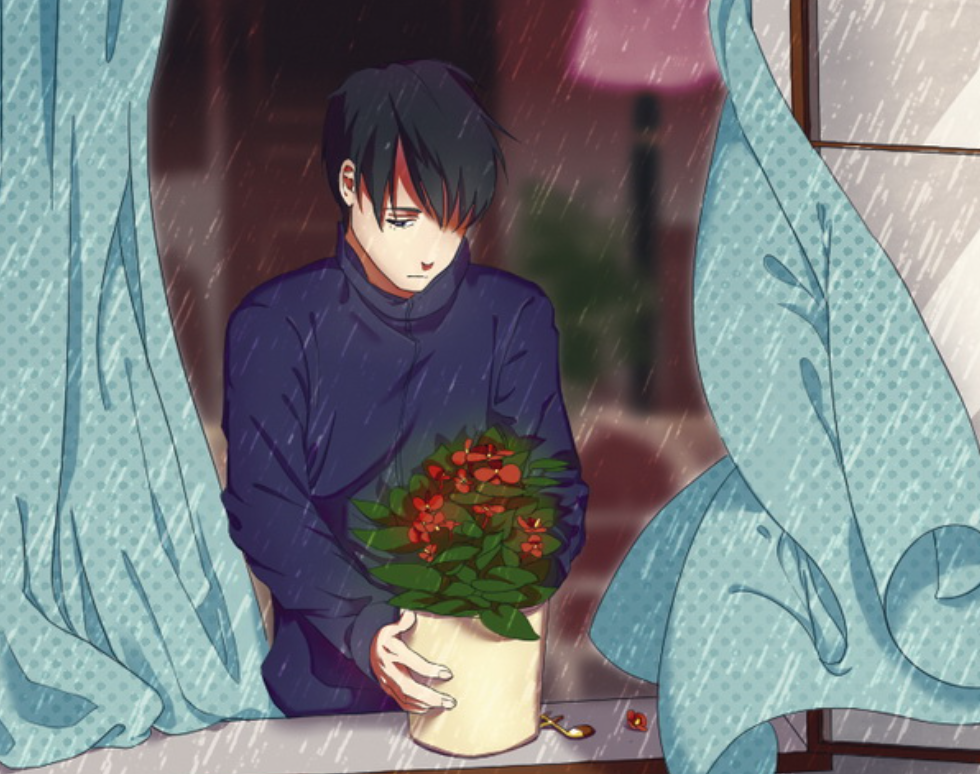
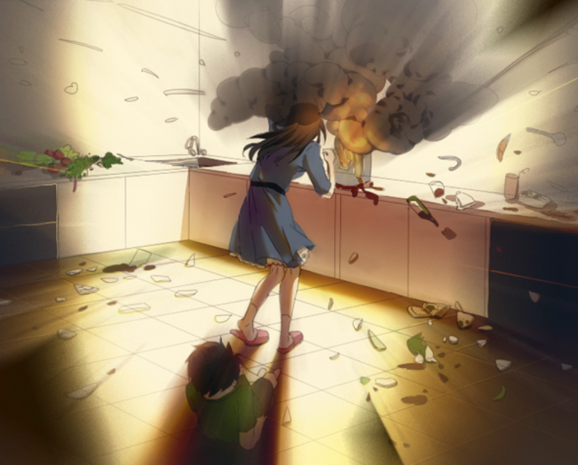

<iframe width="100%" height="468" src="https://www.youtube.com/embed/dzoC4jqQmyo" title="【MƯA QUẠ】TRIỆU HẠT MƯA RƠI HẾT VÀO BẠN || #1 | SCHNAVIA GLÜCKLICHKEIT" frameborder="0" allow="accelerometer; autoplay; clipboard-write; encrypted-media; gyroscope; picture-in-picture; web-share" referrerpolicy="strict-origin-when-cross-origin" allowfullscreen></iframe>

>## [Tải Xuống ⬇️](https://drive.google.com/file/d/1qcnwRDBgrQ_RVI5lzHB2CIfocRZBvn4i/view) 
---
## 📖【Giới thiệu game】

- Có hai anh em nọ sống trong một ngôi nhà. Một ngày nọ, vì quên khóa ga mà hai người phải nhập viện. Liệu số phận của họ sẽ đi đến đâu?

:::note
- Game có nội dung tầm 2-3h chơi
:::
## 🖥️【Ảnh chụp màn hình】

## 🎮【Cách điều khiển】

| Tương tác               | Phím bấm
|-------------------------|----------------------------------------------------------------------------------------------------------------------------------------|
| `Di chuyển`             | Phím mũi tên                                                                                                                           |
| `Điều tra / Xác nhận`   | Z / Space                                                                                                                              |
| `Menu / Hủy`            | X / ESC                                                                                                                                |
| `Sử dụng vật phẩm`      | Mở menu → chọn vật phẩm → nhấn phím xác nhận                                                                                           |
| `Tăng tốc`              | Shift                                                                                                                                  |

## ⚠️【Lưu ý】
:::tip
Không có lưu ý nào cả!
:::
🫰 Cuối cùng chúc mọi người chơi game vui vẻ 0w0