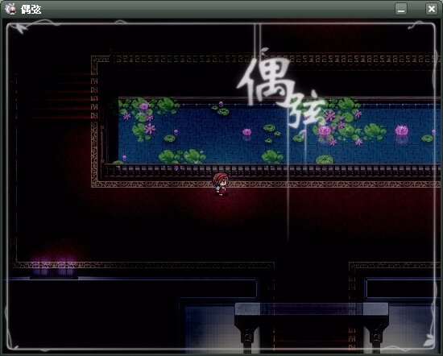
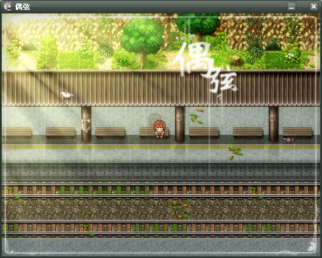
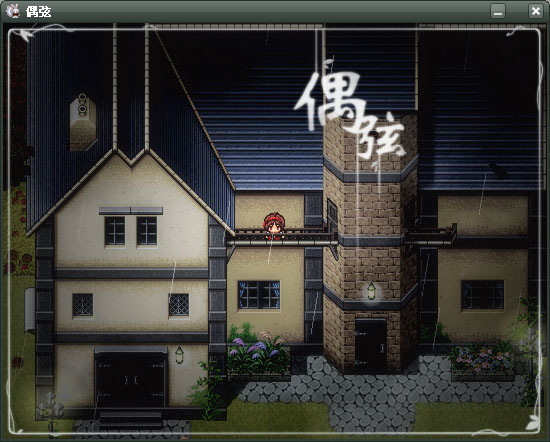
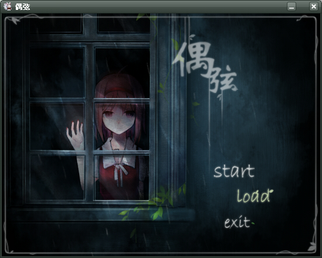
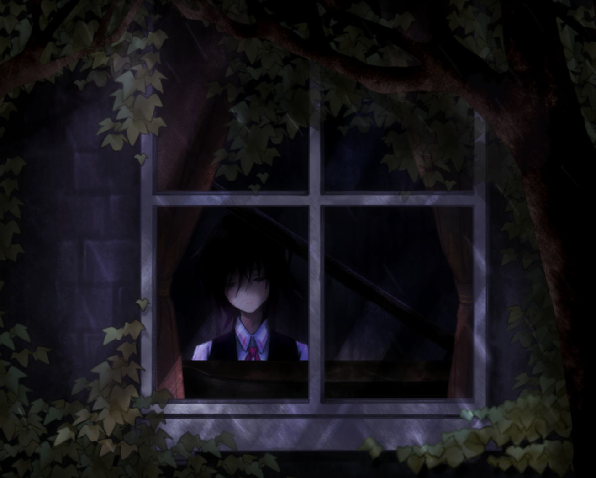

<iframe width="100%" height="468" src="https://www.youtube.com/embed/fGPh7B1cBFA" title="[Việt Hóa] Ngày Dài - Bạn Tỉnh Dậy Trong Một Căn Phòng Bí Ẩn?" frameborder="0" allow="accelerometer; autoplay; clipboard-write; encrypted-media; gyroscope; picture-in-picture; web-share" referrerpolicy="strict-origin-when-cross-origin" allowfullscreen></iframe>

>## [Tải Xuống (GG Drive) ⬇️](https://drive.google.com/file/d/1ITO3XhRRn0gbPnV66bp3x8tu68zY4NLs/view) 

---
## 📖【Giới thiệu game】

- Đây là một câu chuyện cổ tích về thời gian.   
Tỉnh dậy từ một giấc mơ, bạn thấy mình đang ở trong một căn phòng kỳ lạ.   
Bạn đang ở đâu? Và tại sao bạn lại ở đây?   
Bạn sẽ khám phá ra sự thật, hay trốn thoát?   
Tất cả phụ thuộc vào bạn—   
:::note
- Game có nội dung tầm 3h chơi với 6 Ending.
:::
## 🖥️【Ảnh chụp màn hình】

## 🎮【Cách điều khiển】

| Tương tác               | Phím bấm
|-------------------------|----------------------------------------------------------------------------------------------------------------------------------------|
| `Di chuyển`             | Phím mũi tên                                                                                                                           |
| `Điều tra / Xác nhận`   | Z / Space                                                                                                                              |
| `Menu / Hủy`            | X / ESC                                                                                                                                |
| `Sử dụng vật phẩm`      | Mở menu → chọn vật phẩm → nhấn phím xác nhận                                                                                           |
| `Tăng tốc`              | Shift                                                                                                                                  |

## ⚠️【Lưu ý】
:::tip
Nếu lỗi font hay cài font game vào máy tính!
:::
🫰 Cuối cùng chúc mọi người chơi game vui vẻ 0w0