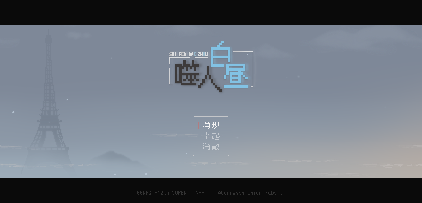
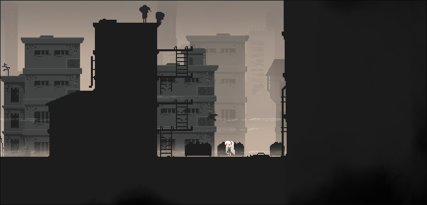
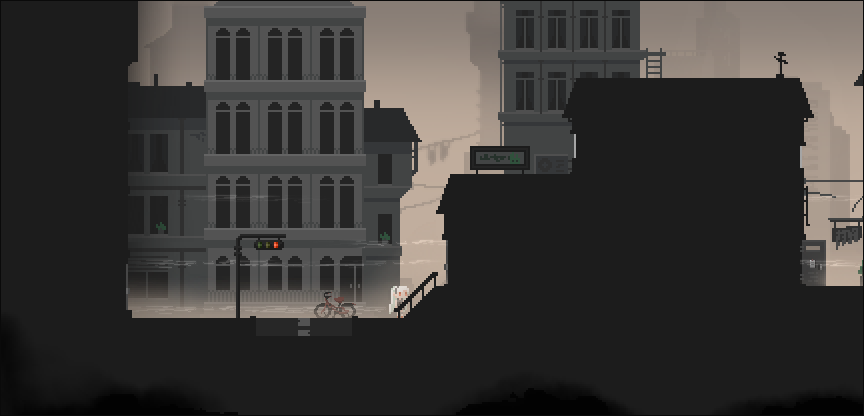
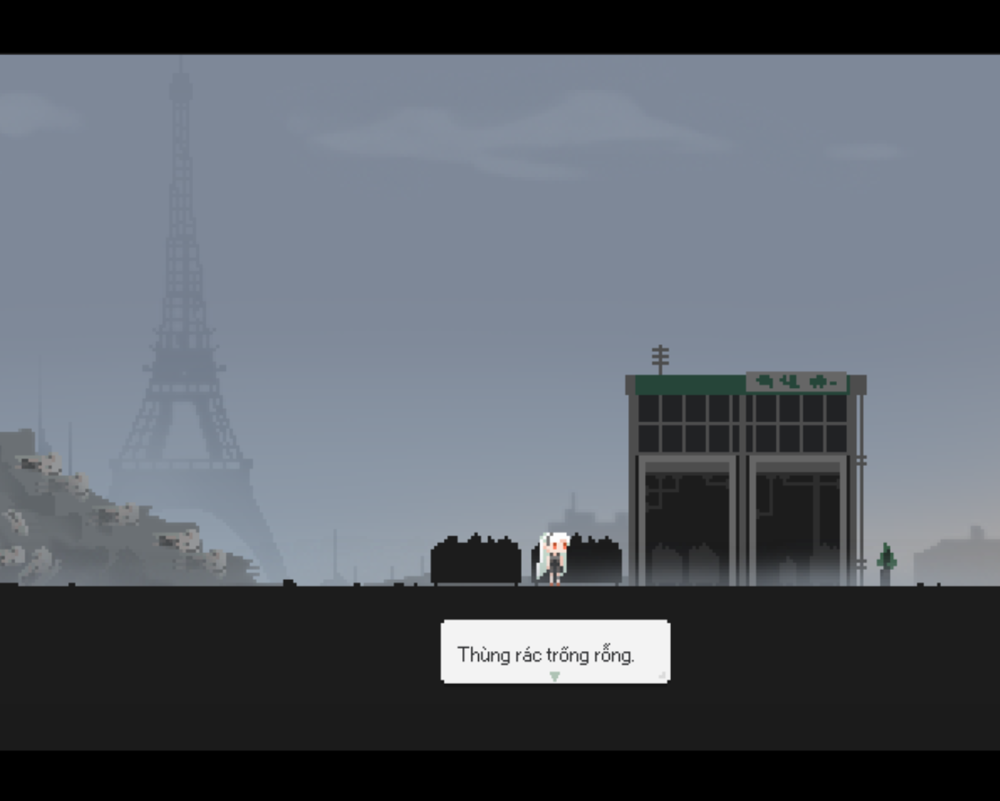
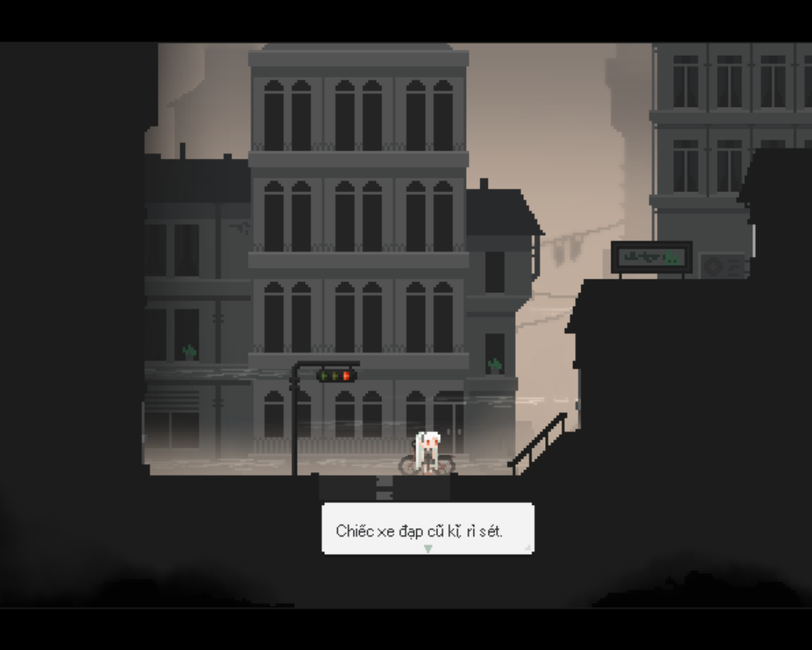

<iframe width="100%" height="468" src="https://www.youtube.com/embed/lCn4inul230" title="[Việt hóa] 噬人白昼/Ngày xám xịt - Cô gái lang thang ở thành phố hoang tàn? (1)" frameborder="0" allow="accelerometer; autoplay; clipboard-write; encrypted-media; gyroscope; picture-in-picture; web-share" referrerpolicy="strict-origin-when-cross-origin" allowfullscreen></iframe>

>## [Tải Xuống ⬇️](https://drive.google.com/file/d/1skZkq8MqTtoYm7lQv3VZA6TOCtH3-9gj/view) 

---
## 📖【Giới thiệu game】

- Trái Đất ngày càng ô nhiễm, do đó không thể sống được trên mặt đất được nữa.  Con người đã quyết định xây dựng như khu định cư ở dưới lòng đất, xây nhà giữa biển. Liệu đó là cách giải quyết đúng đắn?
:::note
- Game có nội dung tầm 30p chơi với 3 ending.
:::
## 🖥️【Ảnh chụp màn hình】

## 🎮【Cách điều khiển】

| Tương tác               | Phím bấm
|-------------------------|----------------------------------------------------------------------------------------------------------------------------------------|
| `Di chuyển`             | Phím mũi tên                                                                                                                           |
| `Điều tra / Xác nhận`   | Z / Space                                                                                                                              |
| `Menu / Hủy`            | X / ESC                                                                                                                                |
| `Sử dụng vật phẩm`      | Mở menu → chọn vật phẩm → nhấn phím xác nhận                                                                                           |
| `Tăng tốc`              | Shift                                                                                                                                  |

## ⚠️【Lưu ý】
:::tip
Nếu lỗi font hay cài font game vào máy tính!
:::
🫰 Cuối cùng chúc mọi người chơi game vui vẻ 0w0