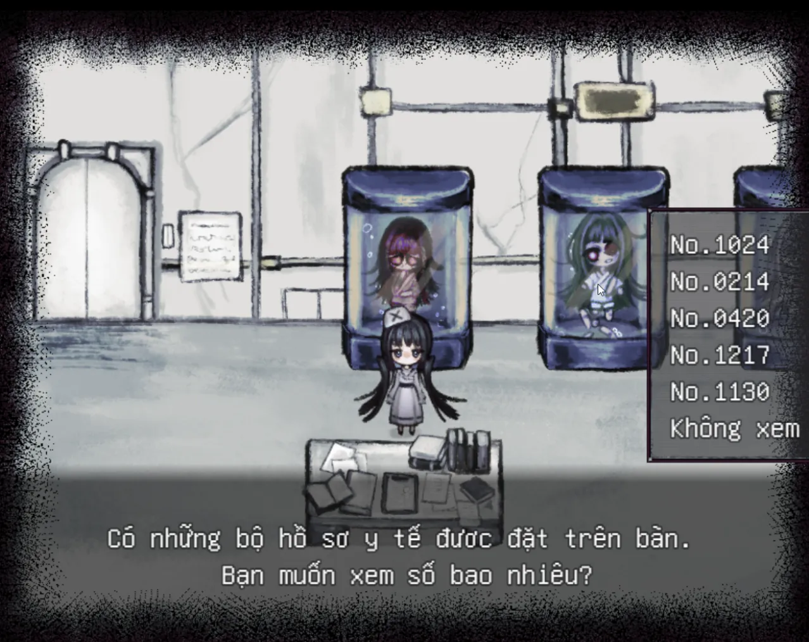

<iframe width="100%" height="468" src="https://www.youtube.com/embed/T98OmjSkqBQ" title="【NGHỀ Y TÁ (看護) + TÔI LÀ… - Việt hóa】SỔ TAY ĐIỀU DƯỠNG || #FULL" frameborder="0" allow="accelerometer; autoplay; clipboard-write; encrypted-media; gyroscope; picture-in-picture; web-share" referrerpolicy="strict-origin-when-cross-origin" allowfullscreen></iframe>

>## [Tải Xuống ⬇️](https://drive.google.com/file/d/1zJo_hAoBXSZ6BqjHvNRf7CsXSWYb1ys1/view) 
---
## 📖【Giới thiệu game】

Nghề Y Tá luôn phải đối mặt với những bệnh nhân kì lạ và những câu chuyện tâm linh. Liệu nhân vật chính trong câu chuyện có đủ nghị lực để vượt qua áp lực này không?
:::note
- Game có nội dung tầm 30p chơi với 5 Ending
:::
## 🖥️【Ảnh chụp màn hình】

## 🎮【Cách điều khiển】

| Tương tác               | Phím bấm
|-------------------------|----------------------------------------------------------------------------------------------------------------------------------------|
| `Di chuyển`             | Phím mũi tên                                                                                                                           |
| `Điều tra / Xác nhận`   | Z / Space                                                                                                                              |
| `Menu / Hủy`            | X / ESC                                                                                                                                |
| `Sử dụng vật phẩm`      | Mở menu → chọn vật phẩm → nhấn phím xác nhận                                                                                           |
| `Tăng tốc`              | Shift                                                                                                                                  |

## 【Lưu ý】
:::tip
Không có lưu ý nào cả!
:::
🫰 Cuối cùng chúc mọi người chơi game vui vẻ 0w0