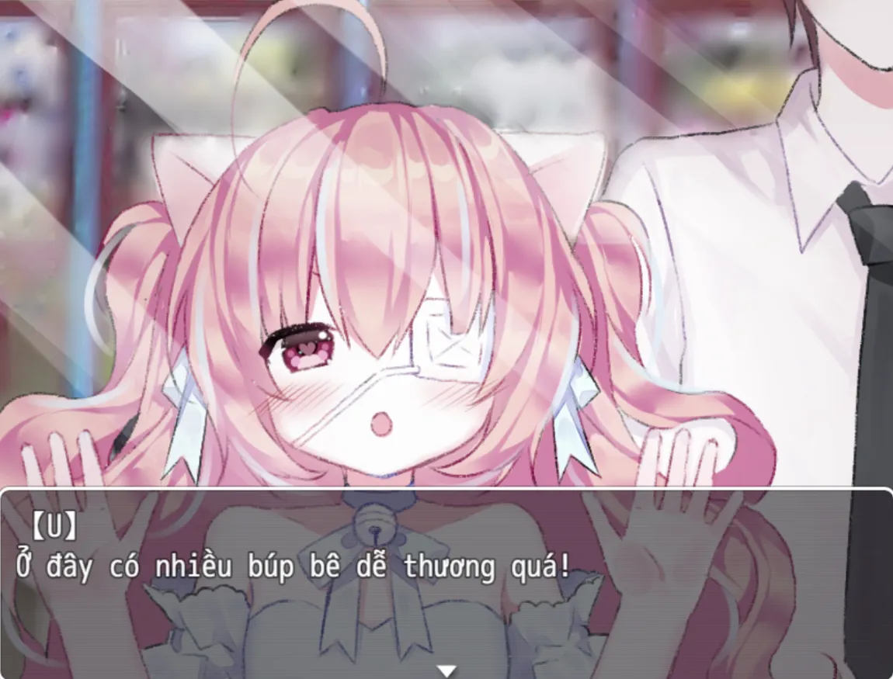
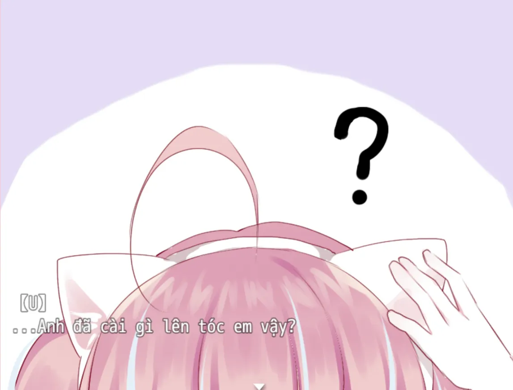
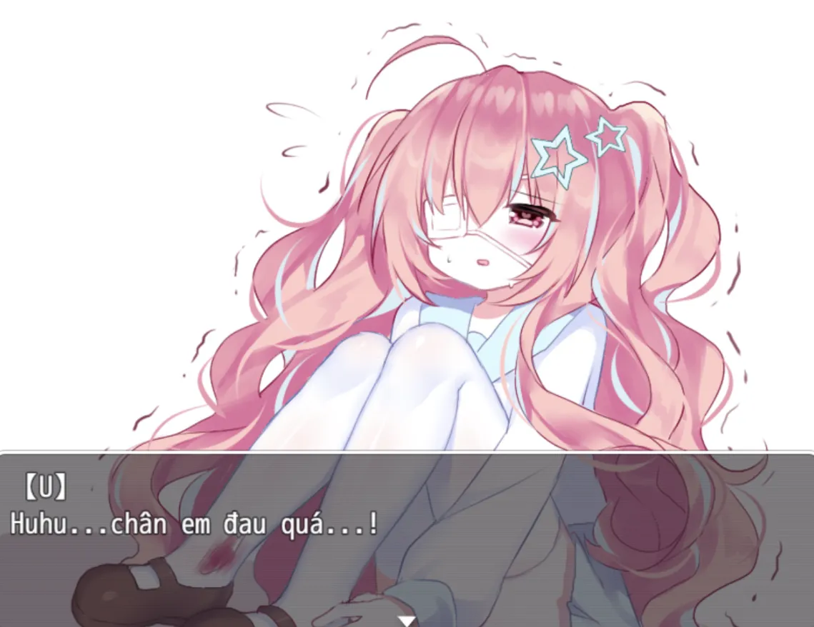

<iframe width="100%" height="468" src="https://www.youtube.com/embed/fwKGFMfZbsI" title="[Việt Hóa] Reset to Zero - Bé Tóc Hồng Trông Dễ Thương?" frameborder="0" allow="accelerometer; autoplay; clipboard-write; encrypted-media; gyroscope; picture-in-picture; web-share" referrerpolicy="strict-origin-when-cross-origin" allowfullscreen></iframe>

>## [Tải Xuống ⬇️](https://drive.google.com/file/d/1hlpzyf7iAf-1ZZK_o_26-vsnk5t600x4/view)
---
## 【Giới thiệu game】

- Nội dung của trò chơi này không liên quan đến bất kỳ cá nhân, nhóm hoặc sự kiện nào trong thế giới thực.
- Game có nội dung tầm 30p chơi với 5 Ending

## 【Ảnh chụp màn hình】

## 【Cách điều khiển】

- Di chuyển: Phím mũi tên  
- Điều tra / Xác nhận: Z / Space  
- Menu / Hủy: X / ESC  
- Sử dụng vật phẩm: Mở menu → chọn vật phẩm → nhấn phím xác nhận  
- Tăng tốc: Shift  

## 【Lưu ý】

Không có lưu ý nào cả!

🫰 Cuối cùng chúc mọi người chơi game vui vẻ 0w0