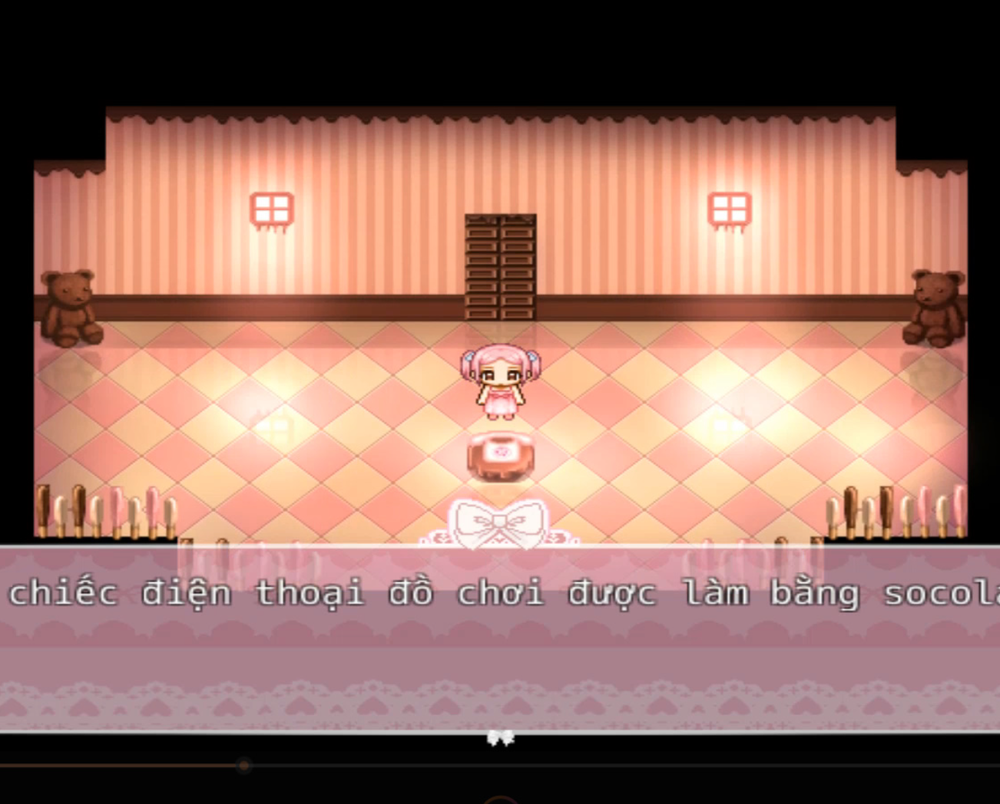

<iframe width="100%" height="468" src="https://www.youtube.com/embed/9Yw-t2vhYjY" title="Sweeter Yesterday (An RPG-Horror Game about Reminiscing)" frameborder="0" allow="accelerometer; autoplay; clipboard-write; encrypted-media; gyroscope; picture-in-picture; web-share" referrerpolicy="strict-origin-when-cross-origin" allowfullscreen></iframe>

>## [Tải Xuống (GG Drive) ⬇️](https://drive.google.com/file/d/18M84Kq8TnF-ryhJAfSfY6RRpppQXu0Ym/view) 

---
## 📖【Giới thiệu game】

- Bạn vào vai một cô bé tên Laletta, và bắt đầu một cuộc phiêu lưu hồi tưởng xuyên suốt thế giới tuổi thơ của mình, gặp gỡ những người bạn tưởng tượng trên đường đi. Tất cả bạn bè của Laletta đều mang trong mình những khía cạnh tính cách của cô bé, vì vậy khi họ bắt đầu trở nên ích kỷ và giả tạo, hoặc phù phiếm và tự cao tự đại... Laletta tự hỏi liệu những tính cách xấu này cũng có trong chính mình không?
   
Hãy cùng theo dõi hành trình tình yêu, nỗi sợ hãi và sự tự khám phá bản thân của Laletta. 
:::note
- Game có nội dung tầm 30p chơi. Đây chỉ là bản DEMO, tính đến năm 2026 thì vẫn đang là DEMO sau 3 năm.
:::
## 🖥️【Ảnh chụp màn hình】

## 🎮【Cách điều khiển】

| Tương tác               | Phím bấm
|-------------------------|----------------------------------------------------------------------------------------------------------------------------------------|
| `Di chuyển`             | Phím mũi tên                                                                                                                           |
| `Điều tra / Xác nhận`   | Z / Space                                                                                                                              |
| `Menu / Hủy`            | X / ESC                                                                                                                                |
| `Sử dụng vật phẩm`      | Mở menu → chọn vật phẩm → nhấn phím xác nhận                                                                                           |
| `Tăng tốc`              | Shift                                                                                                                                  |

## ⚠️【Lưu ý】
:::tip
Nếu lỗi font hay cài font game vào máy tính!
:::
🫰 Cuối cùng chúc mọi người chơi game vui vẻ 0w0