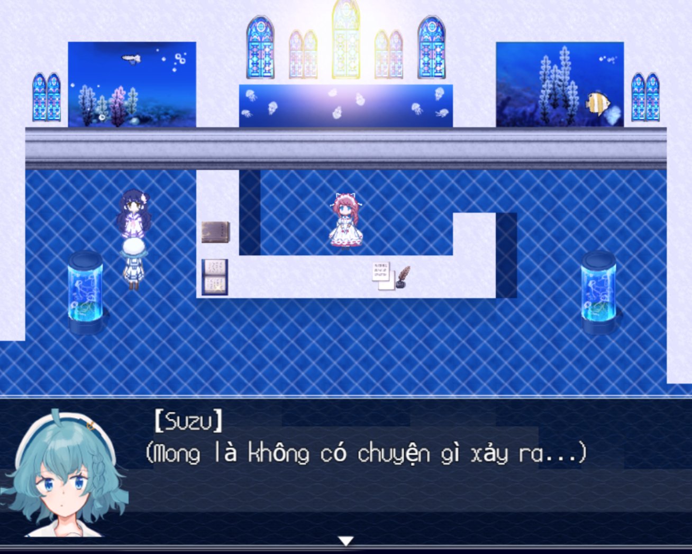
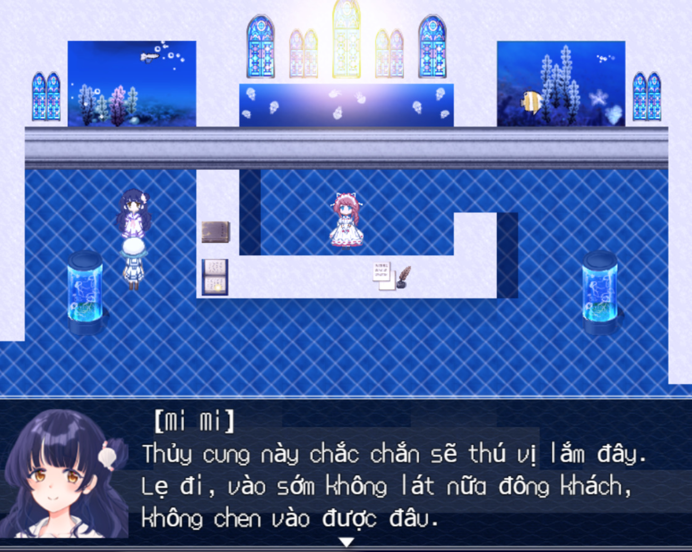

<iframe width="100%" height="468" src="https://www.youtube.com/embed/YIE5GTfL8KA" title="[Việt Hóa] The Aquarium does not dance - Một Cô Bé Đi Tìm Bạn Mình Ở Thủy Cung...[1]" frameborder="0" allow="accelerometer; autoplay; clipboard-write; encrypted-media; gyroscope; picture-in-picture; web-share" referrerpolicy="strict-origin-when-cross-origin" allowfullscreen></iframe>

>## [Tải Xuống (Tên Nhân Vật Tiếng Việt) ⬇️](https://drive.google.com/file/d/1-WAcZD_AvrPJF-jv95V0r4yDCaPRW_Fd/view) 
>## [Tải Xuống (Tên Nhân Vật Tiếng Nhật) ⬇️](https://drive.google.com/file/d/1Xjl_JES_YmeSHF5KNw7SqkFL8svuOa7z/view) 

---
## 📖【Giới thiệu game】

- Đây là một trò chơi phiêu lưu kinh dị, trong đó một cô gái, hết lòng vì người bạn thân nhất của mình, đi tìm người bạn ấy trong một thủy cung đã biến thành thế giới kinh dị.
:::note
- Game có nội dung tầm 3-5h chơi với 5 Ending.
:::
## 🖥️【Ảnh chụp màn hình】

## 🎮【Cách điều khiển】

| Tương tác               | Phím bấm
|-------------------------|----------------------------------------------------------------------------------------------------------------------------------------|
| `Di chuyển`             | Phím mũi tên                                                                                                                           |
| `Điều tra / Xác nhận`   | Z / Space                                                                                                                              |
| `Menu / Hủy`            | X / ESC                                                                                                                                |
| `Sử dụng vật phẩm`      | Mở menu → chọn vật phẩm → nhấn phím xác nhận                                                                                           |
| `Tăng tốc`              | Shift                                                                                                                                  |

## ⚠️【Lưu ý】
:::tip
Nếu lỗi font hay cài font game vào máy tính!
:::
🫰 Cuối cùng chúc mọi người chơi game vui vẻ 0w0