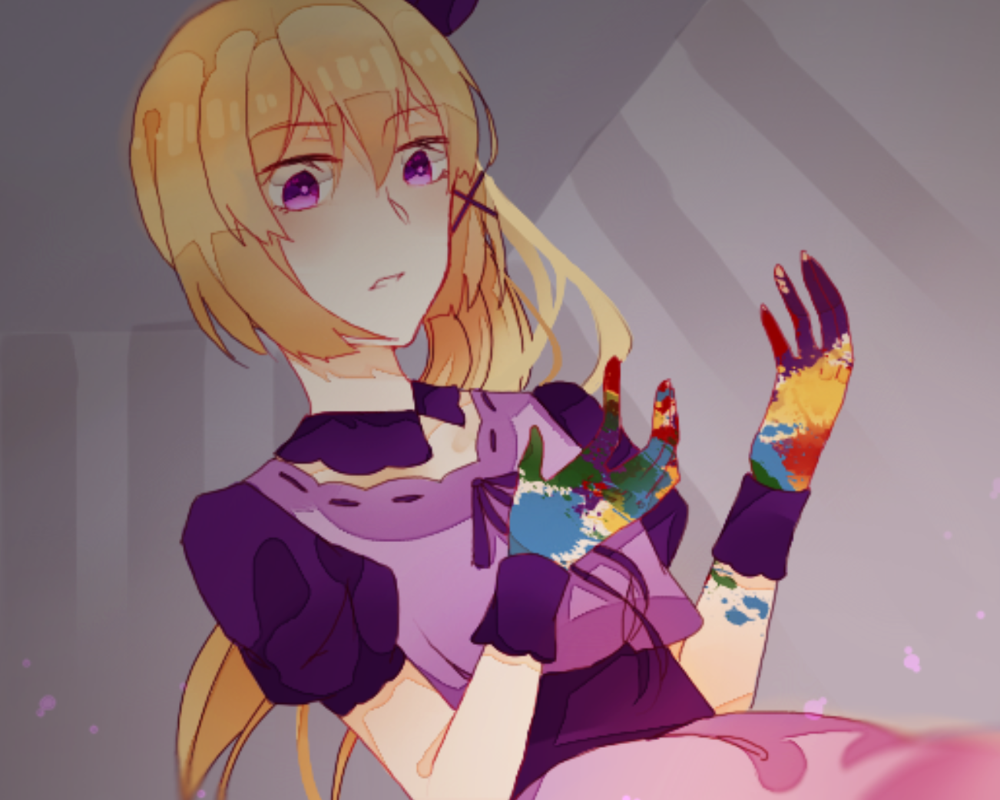

<iframe width="100%" height="468" src="https://www.youtube.com/embed/7-6ksfSxMxQ" title="[Việt Hóa] The Sunny Day 晴天 - Có Vẻ Hôm Nay Là Ngày Đẹp Trời?" frameborder="0" allow="accelerometer; autoplay; clipboard-write; encrypted-media; gyroscope; picture-in-picture; web-share" referrerpolicy="strict-origin-when-cross-origin" allowfullscreen></iframe>

>## [Tải Xuống ⬇️](https://drive.google.com/file/d/16W3KZnekliKDuRWBPhrvID-YximcbKXj/view)
>## [Tải Xuống (Font Tiếng Việt) ⬇️](https://drive.google.com/file/d/1Le3NDYAl-b_kz1nmBmlOkgHTjs-9hvES/view) 

---
## 📖【Giới thiệu game】

- Hôm nay dường như là một ngày nắng đẹp. KUI luôn thức dậy và đọc sách, nhưng nụ cười duyên dáng của cô ấy không còn nữa. Cánh cửa phòng ngủ màu đỏ, con búp bê mặt trời bị bỏ rơi, những cánh hoa hướng dương biến mất... Cô phát hiện ra cánh cửa ở góc phòng đã mở...
:::note
- Game có nội dung tầm 3-6h chơi với 5 ending.
:::
## 🖥️【Ảnh chụp màn hình】

## 🎮【Cách điều khiển】

| Tương tác               | Phím bấm
|-------------------------|----------------------------------------------------------------------------------------------------------------------------------------|
| `Di chuyển`             | Phím mũi tên                                                                                                                           |
| `Điều tra / Xác nhận`   | Z / Space                                                                                                                              |
| `Menu / Hủy`            | X / ESC                                                                                                                                |
| `Sử dụng vật phẩm`      | Mở menu → chọn vật phẩm → nhấn phím xác nhận                                                                                           |
| `Tăng tốc`              | Shift                                                                                                                                  |

## ⚠️【Lưu ý】
:::tip
Nếu lỗi font hay cài font game vào máy tính!
:::
🫰 Cuối cùng chúc mọi người chơi game vui vẻ 0w0