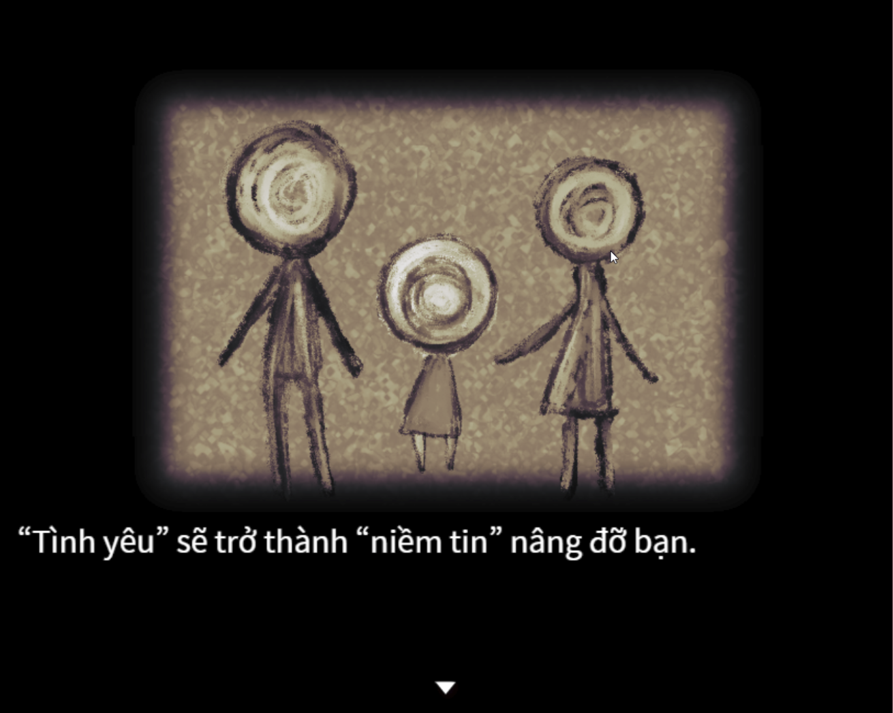
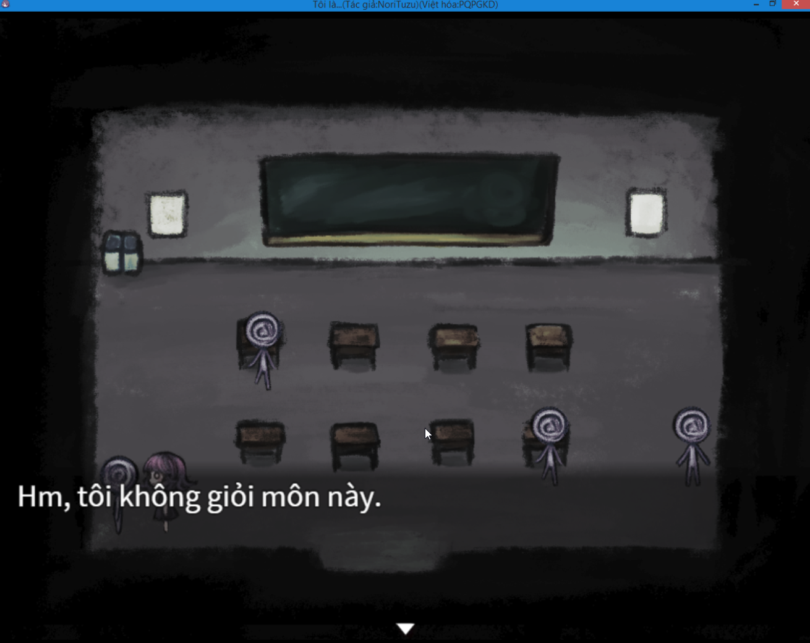
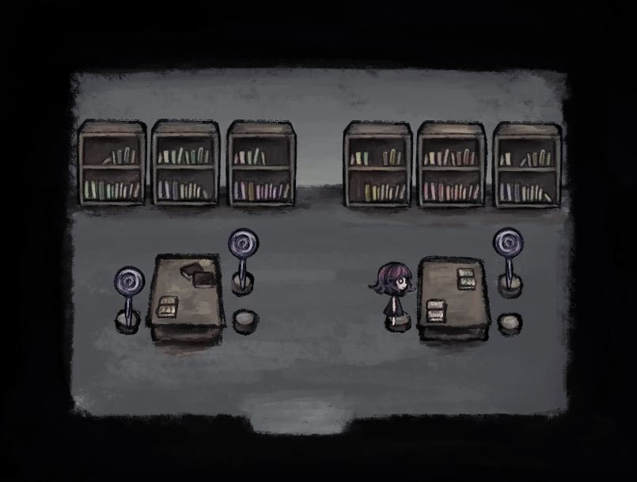
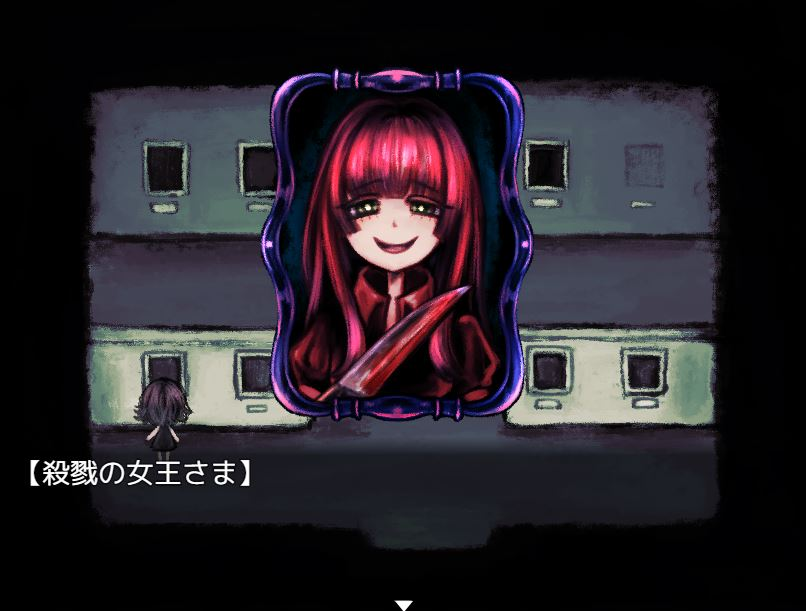

>## [Tải Xuống ⬇️](https://drive.google.com/file/d/1FwPLctByAqbASg5fD6kUd4UqfrEV2U0J/view) 

---
## 📖【Giới thiệu game】

- Thế giới sẽ như thế nào trong mắt những đứa trẻ thiếu tình thương của cha mẹ?
:::note
- Game có nội dung tầm 15p chơi với 5 ending.
:::
## 🖥️【Ảnh chụp màn hình】

## 🎮【Cách điều khiển】

| Tương tác               | Phím bấm
|-------------------------|----------------------------------------------------------------------------------------------------------------------------------------|
| `Di chuyển`             | Phím mũi tên                                                                                                                           |
| `Điều tra / Xác nhận`   | Z / Space                                                                                                                              |
| `Menu / Hủy`            | X / ESC                                                                                                                                |
| `Sử dụng vật phẩm`      | Mở menu → chọn vật phẩm → nhấn phím xác nhận                                                                                           |
| `Tăng tốc`              | Shift                                                                                                                                  |

## ⚠️【Lưu ý】
:::tip
Nếu lỗi font hay cài font game vào máy tính!
:::
🫰 Cuối cùng chúc mọi người chơi game vui vẻ 0w0