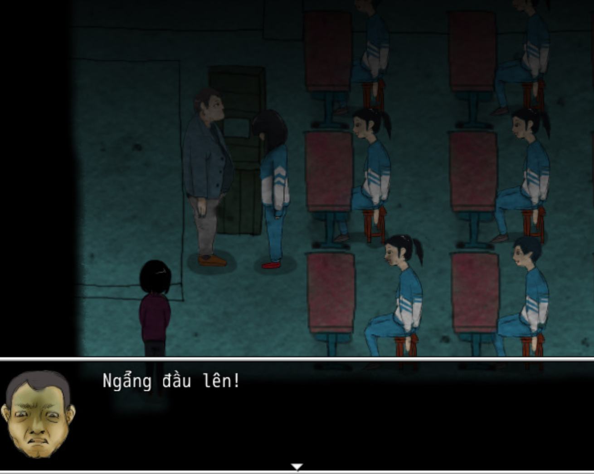
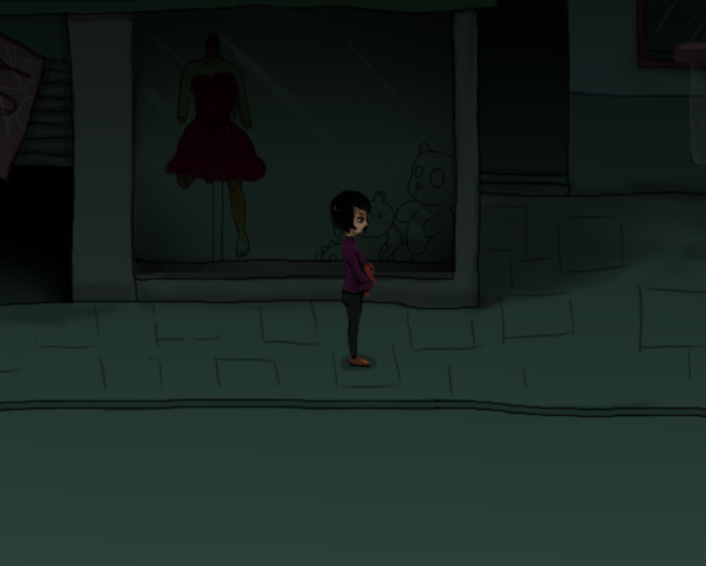
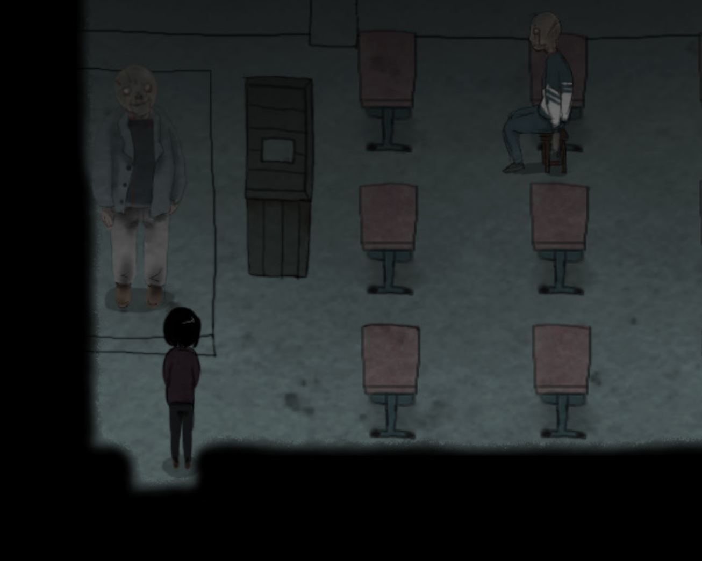
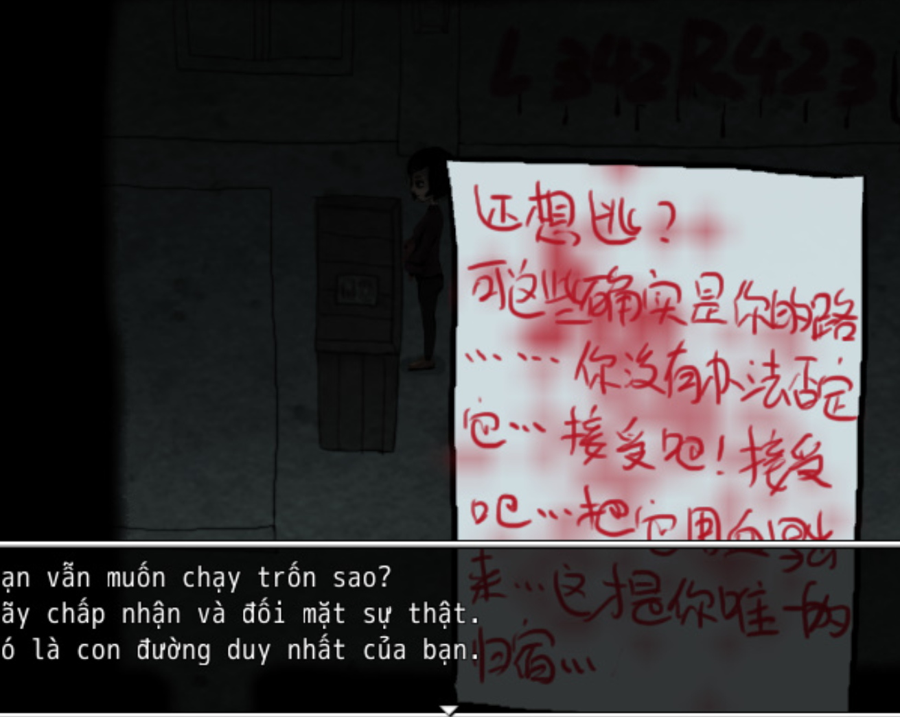

<iframe width="100%" height="468" src="https://www.youtube.com/embed/r1pNw8wwevU" title="[Việt Hóa] Vùng Đất Vĩnh Lạc - Một Game Kinh Dị!" frameborder="0" allow="accelerometer; autoplay; clipboard-write; encrypted-media; gyroscope; picture-in-picture; web-share" referrerpolicy="strict-origin-when-cross-origin" allowfullscreen></iframe>

>## [Tải Xuống (GG Drive) ⬇️](https://drive.google.com/file/d/1EfeIjh0hRyZB7Xg0_lC9jMyF7AWyY6ip/view) 

---
## 📖【Giới thiệu game】

- Nếu tớ nhắm mắt lại… liệu bóng tối có biến mất không…? Bình minh luôn ló dạng… sau một đêm dài… cậu phải tỉnh dậy…
:::note
- Game có nội dung tầm 1h chơi với 2 Ending.
:::
## 🖥️【Ảnh chụp màn hình】

## 🎮【Cách điều khiển】

| Tương tác               | Phím bấm
|-------------------------|----------------------------------------------------------------------------------------------------------------------------------------|
| `Di chuyển`             | Phím mũi tên                                                                                                                           |
| `Điều tra / Xác nhận`   | Z / Space                                                                                                                              |
| `Menu / Hủy`            | X / ESC                                                                                                                                |
| `Sử dụng vật phẩm`      | Mở menu → chọn vật phẩm → nhấn phím xác nhận                                                                                           |
| `Tăng tốc`              | Shift                                                                                                                                  |

## ⚠️【Lưu ý】
:::tip
Nếu lỗi font hay cài font game vào máy tính!
:::
🫰 Cuối cùng chúc mọi người chơi game vui vẻ 0w0