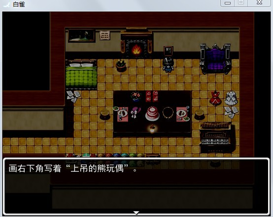
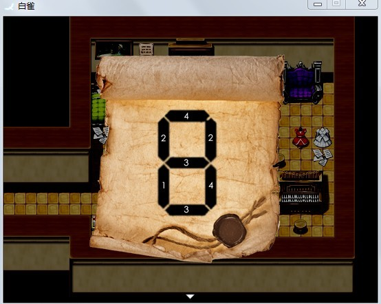

<iframe width="100%" height="468" src="https://www.youtube.com/embed/NDwn0fMq720" title="[White Dove - Việt hóa] Tại sao &quot;dove&quot; là &quot;chim sẻ&quot;? || #1 (True Ending &amp; Bad Ending)" frameborder="0" allow="accelerometer; autoplay; clipboard-write; encrypted-media; gyroscope; picture-in-picture; web-share" referrerpolicy="strict-origin-when-cross-origin" allowfullscreen></iframe>

>## [Tải Xuống ⬇️](https://drive.google.com/file/d/189Mi7s6xDYdSRV5hj-CSgVzc0QJFV49i/view) 
---
## 🌟【Lời nói đầu】

Tôi đã sử dụng **RPG Maker** được một thời gian rồi… nhưng vẫn chưa cho ra mắt nhiều sản phẩm hoàn chỉnh, chủ yếu chỉ tập trung vào RPG.

Tuy nhiên, dạo gần đây tôi lại bị nghiện xem các video chơi game kinh dị, thế nên đây là lần đầu tiên tôi thử làm game giải đố kinh dị đó, cũng là màn ra mắt của tôi luôn **wwwww :3**

Tên game thì chỉ là tình cờ lên mạng thấy hình một con chim, thế nên từ đó tôi nghĩ ra cái tên **White Dove** luôn OTZ.

So với các tác phẩm giải đố khác thì tác phẩm này của tôi **thiên về cốt truyện hơn.**

Dù là game kinh dị giải đố, nhưng **kết cục lại khá “chữa lành” đó nhé!**

Hy vọng tác phẩm này có thể đáp ứng được mong đợi của mọi người (chắc thế…)

## 📖【Giới thiệu game】

Không biết phải viết giới thiệu sao nữa, đại khái là… mọi người hiểu mà ha……
:::note
Game có **tổng cộng 6 kết cục**:  
**5 BAD END**  
**1 TRUE END**
:::
Các kết cục chết thông thường (tức **GAME OVER**) **không tính** vào đây.

Theo lộ trình bình thường, chỉ cần chơi từ đầu tới cuối thì **về cơ bản có thể xem được toàn bộ các kết cục**. 

Sau mỗi BAD END sẽ có **gợi ý cách tránh kết cục đó**.
:::warning
**Lưu ý nhỏ:**  
Khi từ **tầng 2 lên tầng 3**, nếu số mảnh nhật ký **dưới 12** → **BAD END**  
Khi từ **tầng 3 lên tầng 4**, nếu số mảnh nhật ký **dưới 24** → **BAD END**
:::
👉 Khuyến nghị mọi người **xem hết tất cả các kết cục** nhé……

Thời lượng chơi thì hình như không ghi trực tiếp được, nhưng trong trường hợp `biết rõ cách chơi, không bị kẹt`, thì khoảng **20 phút** là xong.

## 🖥️【Ảnh chụp màn hình】

## 🎮【Cách điều khiển】

| Tương tác               | Phím bấm
|-------------------------|----------------------------------------------------------------------------------------------------------------------------------------|
| `Di chuyển`             | Phím mũi tên                                                                                                                           |
| `Điều tra / Xác nhận`   | Z / Space                                                                                                                              |
| `Menu / Hủy`            | X / ESC                                                                                                                                |
| `Sử dụng vật phẩm`      | Mở menu → chọn vật phẩm → nhấn phím xác nhận                                                                                           |
| `Tăng tốc`              | Shift                                                                                                                                  |

*(Để cảm nhận không khí tốt hơn thì không khuyến khích tăng tốc quá nhiều, nhưng yên tâm là **không có cảnh truy đuổi** đâu~)*

## ⚠️【Lưu ý】
:::tip
- Trong game có các hình ảnh và âm thanh xuất hiện đột ngột để “hù”, vì vậy hãy cẩn thận…  
- Ở màn hình tiêu đề, có thể dùng phím mũi tên trái/phải để chọn **Start** hoặc **Load** (tại lúc chơi thử đã từng có người không biết mà bấm nhầm...)  
- Thực tế game có **16 ô lưu**, hãy lưu game thường xuyên.
- Qua kiểm tra hiện chưa phát hiện BUG nào, nếu gặp BUG xin hãy phản hồi lại.
- Nếu bị kẹt trong quá trình chơi thì cũng có thể phản hồi.
:::

:::caution
Sau đây là **một số BUG có khả năng xảy ra**:

1. Nếu nhân vật tự động đi về một hướng nào đó, hoặc màn hình tiêu đề tự động trỏ vào **LOAD**, hãy nhấn nhiều lần các phím **2 / 4 / 6 / 8 trên bàn phím số** để khắc phục.

2. Ở tầng 1, sau khi đã lấy được chìa khóa mà vẫn tiếp tục bắt chuột thì có thể khiến game bị kẹt về sau. Vì vậy sau khi lấy chìa khóa, xin **đừng tiếp tục trêu chọc vết nứt** nữa【đùa thôi...】

3. Ở tầng 4, khu vực bên trái **có khả năng tự dưng “sống lại”** sau khi kết thúc ở tầng hầm, vì vậy hãy **xử lý xong hai bên trái/phải của tầng 4 trước**, rồi hẵng xuống tầng hầm.【Cái này cực kỳ quái... vì trong game hoàn toàn không hề thiết lập như vậy...】
:::

🫰Cuối cùng, **chúc mọi người chơi game vui vẻ** 0w0